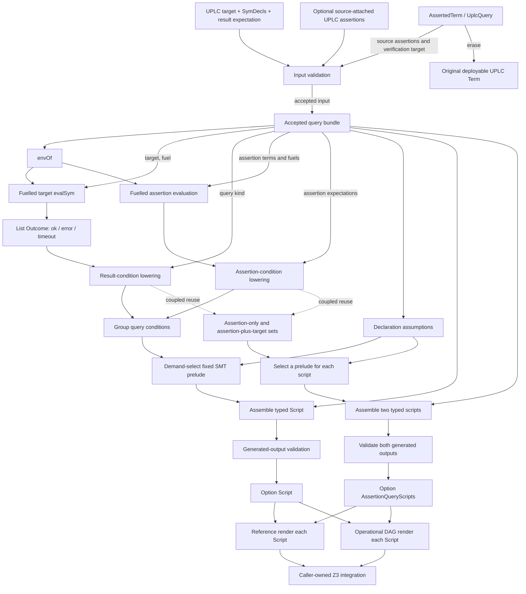

# UPLC-to-SMT compiler API and executable architecture

This guide describes how to use Moist's executable UPLC-to-SMT compiler, how
the compiler turns a UPLC term into a typed SMT command stream, and every
production optimization currently applied along that path.

The scope is deliberately limited to executable compiler code. It does not
describe the architecture of the proof modules or reproduce the soundness
argument. Proof-carrying wrappers are likewise outside the API inventory
below; the focus is the portable `Moist.SMT.Compiler` surface that returns a
plain checked `Script` or coupled pair of checked scripts.

## Guide map

- [Quick start](#quick-start) shows the shortest checked compile/render/run
  path.
- [Production compilation API](#production-compilation-api) is the complete
  checked runtime surface.
- [Symbolic declarations](#symbolic-declarations) and
  [UPLC assertions](#uplc-assertion-api) define query inputs.
- [Rendering and invoking Z3](#rendering-and-invoking-z3) covers both
  renderers and the external-process boundary.
- [Lower-level APIs](#lower-level-apis) documents input-only and unchecked
  construction tiers.
- [Executable architecture](#executable-architecture) follows a term from
  validation through symbolic execution to a typed script.
- [Supported builtin coverage](#supported-builtin-coverage) records the exact
  production whitelist.
- [Production optimizations](#production-optimizations) catalogs every
  current optimization, fallback, and important limitation.

## Quick start

Use the checked compiler for production queries and opt into the DAG renderer
for large formulas:

```lean
import Moist.SMT.Compiler.Operational

namespace Example

open Moist.Plutus.Term
open Moist.SMT
open Moist.SMT.UPLC

private abbrev tyInt : BuiltinType := .AtomicType .TypeInteger

private def int (value : Int) : Term :=
  .Constant (.Integer value, tyInt)

private def app (function argument : Term) : Term :=
  .Apply function argument

private def app2 (builtin : BuiltinFun) (left right : Term) : Term :=
  app (app (.Builtin builtin) left) right

def x : SymDecl := symInt "x"

-- Ask Z3 for an x such that x + 5 == 10.
def target : Term :=
  app2 .EqualsInteger
    (app2 .AddInteger (.Var 1) (int 5))
    (int 10)

unsafe def main : IO Unit := do
  let script ←
    match Moist.SMT.Compiler.compileBoolTrue? 40 [x] target with
    | some script => pure script
    | none => throw <| IO.userError "SMT compiler rejected the query"

  IO.FS.writeFile "query.smt2" script.renderDag
  IO.println "wrote query.smt2"

end Example

unsafe def main : IO Unit := Example.main
```

Run it with:

```console
taskset -c 0-7 env LEAN_NUM_THREADS=8 lake build
lake env lean --run Example.lean
z3 query.smt2
```

The first command prepares the repository's Lean dependencies on a clean
checkout while respecting this workspace's eight-core limit. Install the
repository's pinned Lean toolchain and Z3 before running the example; Z3 is an
external executable rather than a Lake dependency.

The first line should be `sat`. The following model assigns the sanitized SMT
name `$u$120` to `5`; `$u$120` is the compiler's injective encoding of the
external name `"x"`.

Use `script.render` instead of `script.renderDag` when a small, transparent
tree rendering is preferable. `renderDag` is usually much smaller for
branch-heavy symbolic programs, but it is an `unsafe` operational renderer
because it discovers sharing through runtime pointer identity.

## Public imports and namespaces

The portable checked compiler and reference renderer are exported by:

```lean
import Moist.SMT.Compiler
```

The practical large-query renderer is exported separately by:

```lean
import Moist.SMT.Compiler.Operational
```

Typical namespace openings are:

```lean
open Moist.Plutus.Term   -- Term, BuiltinFun, BuiltinType, Const
open Moist.SMT           -- SSort, Expr, Command, Script
open Moist.SMT.UPLC      -- SymDecl, SExpr, UplcAssertion, constructors
open Moist.SMT.Compiler  -- QueryKind, AssertionQueryScripts
```

The physical implementation files live under `Moist/SMT/Compiler/UPLC`, but
the stable executable declarations remain in the `Moist.SMT.UPLC` namespace.

## Core query model

Targets and source assertions share one result language:

```lean
inductive Moist.SMT.UPLC.UplcAssertionExpectation where
  | succeeds
  | boolEq (expected : Bool)
  | intEq (expected : Int)
  | error

abbrev Moist.SMT.Compiler.QueryKind :=
  Moist.SMT.UPLC.UplcAssertionExpectation
```

`QueryKind.boolTrue` remains as a source-compatible spelling of
`.boolEq true`. The generated conditions are:

| Query kind | Required symbolic outcome |
| --- | --- |
| `.succeeds` | Any active successful outcome, including a closure, delay, constructor, or other CEK value. |
| `.boolEq b` | An active successful outcome containing exactly UPLC `Bool b`. |
| `.intEq n` | An active successful outcome containing exactly UPLC integer `n`. |
| `.error` | An active runtime-error outcome. |

`.succeeds` is the direct “runs without error and produces a value” query. An
error and a fuel timeout do not satisfy it. A value of the wrong kind does not
satisfy either typed equality. A timeout also does not satisfy `.error`;
timeout means the symbolic compiler stopped unrolling, not that the UPLC
program failed.

For a result condition more general than Boolean or integer equality, apply an
ordinary UPLC consumer to the result and query that consumer. This supports
structured values and relationships with inputs without inventing an equality
over closures or other higher-order CEK values. See
[Source-attached UPLC queries](#source-attached-uplc-queries).

Symbolic declarations are existential solver variables. There is no separate
universal query kind. A `sat` model is a candidate witness for the requested
UPLC result. A caller may construct a UPLC counterexample predicate and search
for a satisfying counterexample, but this plain compiler API does not turn
`unsat` into a theorem that no CEK counterexample exists. That conclusion
requires a separate completeness layer and is intentionally outside this
compiler-only guide.

## Production compilation API

All recommended entry points return `Option` containing either one checked
`Script` or a checked `AssertionQueryScripts` pair. `some` means the input was
accepted, each canonical script was generated once, and the exact generated
command AST passed the production output checks. It does **not** mean that a
script is satisfiable. `none` means fail-closed compiler rejection, not UPLC
runtime error and not solver `unsat`.

### Targets without UPLC assertions

```lean
Moist.SMT.Compiler.compile? :
  QueryKind → Nat → List SymDecl → Term → Option Script

Moist.SMT.Compiler.compileSucceeds? :
  Nat → List SymDecl → Term → Option Script

Moist.SMT.Compiler.compileBoolTrue? :
  Nat → List SymDecl → Term → Option Script

Moist.SMT.Compiler.compileBoolEq? :
  Nat → List SymDecl → Term → Bool → Option Script

Moist.SMT.Compiler.compileIntEq? :
  Nat → List SymDecl → Term → Int → Option Script

Moist.SMT.Compiler.compileError? :
  Nat → List SymDecl → Term → Option Script
```

The `Nat` argument is symbolic-evaluation fuel. The convenience functions
cover every expectation; `compileBoolTrue?` is the compatibility specialization
of `compileBoolEq?` at `true`.

### Targets restricted by UPLC assertions

```lean
Moist.SMT.Compiler.compileWithAssertions? :
  QueryKind → Nat → List SymDecl → List UplcAssertion → Term →
    Option Script

Moist.SMT.Compiler.compileSucceedsWithAssertions? :
  Nat → List SymDecl → List UplcAssertion → Term → Option Script

Moist.SMT.Compiler.compileBoolTrueWithAssertions? :
  Nat → List SymDecl → List UplcAssertion → Term → Option Script

Moist.SMT.Compiler.compileIntEqWithAssertions? :
  Nat → List SymDecl → List UplcAssertion → Term → Int →
    Option Script

Moist.SMT.Compiler.compileBoolEqWithAssertions? :
  Nat → List SymDecl → List UplcAssertion → Term → Bool →
    Option Script

Moist.SMT.Compiler.compileErrorWithAssertions? :
  Nat → List SymDecl → List UplcAssertion → Term → Option Script
```

Every assertion and the target see the same symbolic declaration environment.
The target has the fuel supplied to the compiler call; each assertion carries
its own fuel.

### Assertion satisfiability and coupled refinement queries

```lean
Moist.SMT.Compiler.compileAssertionsSatisfiable? :
  List SymDecl → List UplcAssertion → Option Script
```

This produces a query containing the declaration assumptions and UPLC
assertions, but no target. It is useful for checking that a refinement context
has at least one witness.

For refinement-style callers, the preferred API constructs the non-vacuity
and target scripts together:

```lean
structure Moist.SMT.Compiler.AssertionQueryScripts where
  satisfiability : Script
  target : Script

Moist.SMT.Compiler.compileAssertionQueries? :
  QueryKind → Nat → List SymDecl → List UplcAssertion → Term →
    Option AssertionQueryScripts

Moist.SMT.Compiler.compileSucceedsAssertionQueries? :
  Nat → List SymDecl → List UplcAssertion → Term →
    Option AssertionQueryScripts

Moist.SMT.Compiler.compileBoolTrueAssertionQueries? :
  Nat → List SymDecl → List UplcAssertion → Term →
    Option AssertionQueryScripts

Moist.SMT.Compiler.compileBoolEqAssertionQueries? :
  Nat → List SymDecl → List UplcAssertion → Term → Bool →
    Option AssertionQueryScripts

Moist.SMT.Compiler.compileIntEqAssertionQueries? :
  Nat → List SymDecl → List UplcAssertion → Term → Int →
    Option AssertionQueryScripts

Moist.SMT.Compiler.compileErrorAssertionQueries? :
  Nat → List SymDecl → List UplcAssertion → Term →
    Option AssertionQueryScripts
```

The assertion conditions are symbolically compiled once and reused in both
scripts. The target is also symbolically evaluated once. Both resulting
scripts are then independently output-checked.

A typical existential workflow is:

1. Solve `scripts.satisfiability`. A `sat` model is a candidate non-vacuity
   witness for the refinement context.
2. Solve `scripts.target` to search for the requested result under those exact
   same declarations and assertions.

An `unsat` status reports that Z3 found no model for the emitted formula. The
plain compiler API alone does not promote that status to a contradictory CEK
context or to absence of a CEK target witness.

### Source-attached UPLC queries

Moist can keep assertions next to the UPLC program they describe while
preserving an exact ordinary-UPLC erasure:

```lean
structure Moist.SMT.UPLC.AssertedTerm where
  term : Term
  assertions : List UplcAssertion := []

inductive Moist.SMT.UPLC.UplcQueryTarget where
  | source
  | applied (target : UplcQueryTarget) (arguments : List Term)
  | consumed (consumer : Term) (target : UplcQueryTarget)

structure Moist.SMT.UPLC.UplcQuery where
  source : AssertedTerm
  targetPlan : UplcQueryTarget := .source
  expectation : UplcAssertionExpectation := .succeeds

AssertedTerm.erase : AssertedTerm → Term
UplcQuery.erase : UplcQuery → Term
UplcQuery.target : UplcQuery → Term
```

`AssertedTerm` is host-side verification metadata, not a new `Term`
constructor. CEK evaluation and Flat serialization receive `erase`, which is
definitionally the original ordinary UPLC term. `targetPlan` is structurally
rooted at `.source`; it cannot store an unrelated target term. `UplcQuery.target`
resolves that plan into a verification-only application or result consumer,
while `UplcQuery.erase` still returns `query.source.term`, never the transformed
target. The checked target scan therefore cannot hide an unsupported builtin
in the erased source. This is the same basic separation used by Plutuss
refined-function records: contracts live beside an ordinary executable UPLC
term rather than extending the UPLC grammar.

This is the sound primitive metadata/query layer, not yet the complete
Plutuss `define/refined` front end. Plutuss additionally stores named typed
input and return schemas, body fuel, effect and recursion metadata, derives
symbolic inputs, and automatically binds declared parameter contracts to a
particular call.

The attachment and query combinators are:

```lean
AssertedTerm.ofTerm : Term → AssertedTerm
AssertedTerm.asserting : AssertedTerm → UplcAssertion → AssertedTerm
AssertedTerm.assertingAll :
  AssertedTerm → List UplcAssertion → AssertedTerm
AssertedTerm.requiringParameter :
  AssertedTerm → Nat → Term → Nat → AssertedTerm
AssertedTerm.requiringParameters :
  AssertedTerm → Nat → Term → List Nat → AssertedTerm
AssertedTerm.requiringParameterChecked? :
  AssertedTerm → List SymDecl → Nat → Term → Nat → Option AssertedTerm
AssertedTerm.requiringParametersChecked? :
  AssertedTerm → List SymDecl → Nat → Term → List Nat → Option AssertedTerm

AssertedTerm.expecting :
  AssertedTerm → UplcAssertionExpectation → UplcQuery
AssertedTerm.succeeds : AssertedTerm → UplcQuery
AssertedTerm.returnsBool : AssertedTerm → Bool → UplcQuery
AssertedTerm.returnsInt : AssertedTerm → Int → UplcQuery
AssertedTerm.errors : AssertedTerm → UplcQuery
AssertedTerm.appliedWith :
  AssertedTerm → UplcAssertionExpectation → List Term → UplcQuery
AssertedTerm.applied : AssertedTerm → List Term → UplcQuery
AssertedTerm.declarationArguments : List SymDecl → List Term
AssertedTerm.appliedToDeclarationsWith :
  AssertedTerm → UplcAssertionExpectation → List SymDecl → UplcQuery
AssertedTerm.appliedToDeclarations :
  AssertedTerm → List SymDecl → UplcQuery
AssertedTerm.resultSatisfiesWith :
  AssertedTerm → UplcAssertionExpectation → Term → UplcQuery
AssertedTerm.resultSatisfies : AssertedTerm → Term → UplcQuery
AssertedTerm.appliedResultSatisfiesWith :
  AssertedTerm → UplcAssertionExpectation → List Term → Term → UplcQuery
AssertedTerm.appliedResultSatisfies :
  AssertedTerm → List Term → Term → UplcQuery
AssertedTerm.declarationResultSatisfiesWith :
  AssertedTerm → UplcAssertionExpectation → List SymDecl → Term → UplcQuery
AssertedTerm.declarationResultSatisfies :
  AssertedTerm → List SymDecl → Term → UplcQuery

UplcQuery.ofTerm :
  Term → UplcAssertionExpectation → UplcQuery
UplcQuery.withExpectation :
  UplcQuery → UplcAssertionExpectation → UplcQuery
UplcQuery.applyArguments :
  UplcQuery → List Term → UplcQuery
UplcQuery.consumeResult :
  UplcQuery → Term → UplcQuery
UplcQuery.asserting : UplcQuery → UplcAssertion → UplcQuery
UplcQuery.assertingAll : UplcQuery → List UplcAssertion → UplcQuery

Term.withAssertions : Term → List UplcAssertion → AssertedTerm
Term.withAssertion : Term → UplcAssertion → AssertedTerm
Term.withParameterAssertion : Term → Nat → Term → Nat → AssertedTerm
Term.withParameterAssertions :
  Term → Nat → Term → List Nat → AssertedTerm
Term.withParameterAssertionChecked? :
  Term → List SymDecl → Nat → Term → Nat → Option AssertedTerm
Term.withParameterAssertionsChecked? :
  Term → List SymDecl → Nat → Term → List Nat → Option AssertedTerm
Term.querying : Term → UplcAssertionExpectation → UplcQuery
Term.queryingSuccess : Term → UplcQuery
Term.queryingResult : Term → Term → UplcQuery
Term.queryingResultWith :
  Term → UplcAssertionExpectation → Term → UplcQuery
Term.queryingAppliedWith :
  Term → UplcAssertionExpectation → List Term → UplcQuery
```

`applyArguments` and `consumeResult` compose recursively over the existing
source-rooted target. `consumeResult consumer` materializes exactly
`.Apply consumer oldTarget`; it follows CEK call-by-value order, so the
consumer expression is evaluated first. If it produces a callable value, CEK
then evaluates `oldTarget` and invokes the consumer. In an `.error` query, the
error may therefore come from the consumer expression before the source is
evaluated. A closed syntactic lambda is the usual result predicate and makes
closure creation trivial before source evaluation.

The fully checked compiler consumes these values directly:

```lean
Moist.SMT.Compiler.compileUplcQuery? :
  Nat → List SymDecl → UplcQuery → Option Script

Moist.SMT.Compiler.compileUplcQueryQueries? :
  Nat → List SymDecl → UplcQuery → Option AssertionQueryScripts

Moist.SMT.Compiler.compileAssertedTerm? :
  QueryKind → Nat → List SymDecl → AssertedTerm → Option Script

Moist.SMT.Compiler.compileAssertedTermQueries? :
  QueryKind → Nat → List SymDecl → AssertedTerm →
    Option AssertionQueryScripts
```

For example, this keeps a deployable lambda unchanged while verifying one
symbolic call and applying a UPLC predicate to that call's result:

```lean
def function : Term := .Lam 0 (.Var 1)
def positive : Term :=
  .Lam 0
    (.Apply
      (.Apply (.Builtin .LessThanInteger)
        (.Constant (.Integer 0, .AtomicType .TypeInteger)))
      (.Var 1))

def source : AssertedTerm :=
  function.withParameterAssertion 80 positive 1

def declarations : List SymDecl :=
  [symInt "parameter"]

def query : UplcQuery :=
  source.declarationResultSatisfies declarations positive

-- query.target verifies: positive (function parameter₁)
-- query.erase is still exactly function
def compiled : Option Script :=
  Moist.SMT.Compiler.compileUplcQuery? 80 declarations query
```

The one-based indices accepted by `requiringParameter(s)` and
`withParameterAssertion(s)` refer to external `SymDecl`s. They do not inspect
lambda binders, and the declaration schema remains an argument of the compile
call rather than a field of `UplcQuery`. Index `0` or an index beyond the
declaration environment is an ordinary unbound-variable CEK error; it is not a
compile-time schema error.

These external assertions are not automatically rebound to arbitrary
arguments passed to `appliedWith`. Prefer `appliedToDeclarationsWith`, which
atomically constructs the call arguments as `.Var 1` through `.Var n` from the
same declaration schema. With the lower-level API, use the same symbolic terms
in both places: an assertion on external `.Var 1` constrains a call only when
the corresponding call argument is also `.Var 1`. Calling the function with
an unrelated constant while constraining an external variable proves the
literal conjunction requested, but it is not a contract on that constant.
Moist does not currently provide Plutuss's named, typed, automatically bound
refined-function declaration layer.

The general result-program facade is also available without constructing a
wrapper explicitly:

```lean
Moist.SMT.Compiler.compileResultProgram? :
  UplcAssertionExpectation → Nat → List SymDecl → Term → Term →
    Option Script

Moist.SMT.Compiler.compileResultSatisfies? :
  Nat → List SymDecl → Term → Term → Option Script

Moist.SMT.Compiler.compileResultProgramWithAssertions? :
  UplcAssertionExpectation → Nat → List SymDecl →
    List UplcAssertion → Term → Term → Option Script

Moist.SMT.Compiler.compileResultSatisfiesWithAssertions? :
  Nat → List SymDecl → List UplcAssertion → Term → Term →
    Option Script

Moist.SMT.Compiler.compileResultProgramAssertionQueries? :
  UplcAssertionExpectation → Nat → List SymDecl →
    List UplcAssertion → Term → Term → Option AssertionQueryScripts

Moist.SMT.Compiler.compileResultSatisfiesAssertionQueries? :
  Nat → List SymDecl → List UplcAssertion → Term → Term →
    Option AssertionQueryScripts
```

Every result-program facade compiles `.Apply consumer term`; each
`*ResultSatisfies*` specialization requires the consumer to return exactly
`Bool true`. CEK evaluates the consumer expression before `term`. With a
closed lambda consumer, its body runs only after `term` successfully produces
a value. For a general `.error` expectation, an error in the consumer
expression can occur before `term` is evaluated. Result consumers share the
single target fuel supplied to compilation; unlike source assertions, they do
not carry independent fuel.

### Diagnosing `none`

The public API intentionally returns no error payload. These executable
predicates help localize a rejection during development:

```lean
Moist.SMT.Compiler.inputAccepted :
  List SymDecl → Term → Bool

Moist.SMT.Compiler.assertionsAccepted :
  List UplcAssertion → Bool

Moist.SMT.Compiler.inputWithAssertionsAccepted :
  List SymDecl → List UplcAssertion → Term → Bool

Moist.SMT.Compiler.assertionSetInputAccepted :
  List SymDecl → List UplcAssertion → Bool

Moist.SMT.Compiler.outputAccepted :
  List SymDecl → Script → Bool

Moist.SMT.Compiler.outputChecked? :
  List SymDecl → Script → Option Script

Moist.SMT.Compiler.assertionQueriesOutputAccepted :
  List SymDecl → AssertionQueryScripts → Bool

Moist.SMT.Compiler.assertionQueriesOutputChecked? :
  List SymDecl → AssertionQueryScripts →
    Option AssertionQueryScripts
```

For a two-stage diagnosis, call the matching `*InputChecked?` function. If it
returns `none`, caller-controlled declarations, the target term, or an
assertion term failed validation. For a single-script result, test
`outputAccepted declarations script`; for a coupled result, test
`assertionQueriesOutputAccepted declarations scripts`. A false result means
generated output failed the compiler's structural tripwires.

## Symbolic declarations

The public input record is:

```lean
structure Moist.SMT.UPLC.SymDecl where
  name : String
  sort : SSort
  value : SymVal
  assumptions : List SExpr := []
```

Use the smart constructors rather than building this record manually:

| Constructor | UPLC value presented to the evaluator | Mandatory SMT assumptions |
| --- | --- | --- |
| `symInt name` | Native symbolic integer | None |
| `symBool name` | Native symbolic Boolean | None |
| `symBytes name` | Native symbolic byte string | `bytes_valid` |
| `symString name` | Native symbolic UPLC string | `ustring_valid` |
| `symData name` | Native symbolic `Data` | `data_valid` |
| `symVal name` | Generic symbolic `Val` | `val_valid` |
| `symConstr name fields` | Runtime constructor with symbolic nonnegative tag and fixed fields | `tag >= 0` |

The exact signatures are:

```lean
symInt    : String → SymDecl
symBool   : String → SymDecl
symBytes  : String → SymDecl
symString : String → SymDecl
symData   : String → SymDecl
symVal    : String → SymDecl
symConstr : String → (fields : List SymVal := []) → SymDecl

SymDecl.withAssumptions : SymDecl → List SExpr → SymDecl
```

Important declaration rules:

- The smart constructors sanitize names immediately. Use `declaration.name`,
  not the original external string, when adding an SMT assumption. Manual
  `SymDecl` construction does not sanitize; the checked compiler rejects a
  name that is not already in canonical sanitized form.
- Sanitization is injective and avoids SMT keywords, leading digits, quoting,
  whitespace, and delimiter collisions.
- Declaration names must be distinct after sanitization.
- Declaration order is UPLC variable order: `Var 1` is the first declaration,
  `Var 2` is the second, and so on. Do not reverse this list as though it were
  a stack of nested lambda binders.
- `withAssumptions` appends constraints; it does not remove mandatory
  validity constraints.
- Extra assumptions must be renderer-safe, Boolean-sorted, and belong to the
  compiler's total public SMT-expression fragment. Partial selectors,
  unguarded sequence indexing, division, and similar operations are rejected
  as declaration assumptions.
- Manual `SymDecl` construction is possible at the Lean type level, but the
  checked compiler revalidates its exact shape, mandatory assumptions, sort,
  decodability, and renderer grammar.

For example, constrain an integer declaration without losing any existing
requirements:

```lean
def fixedInt (externalName : String) (value : Int) : SymDecl :=
  let declaration := symInt externalName
  declaration.withAssumptions
    [SExpr.eq (.sym declaration.name) (.int value)]

def boundedInt : SymDecl :=
  let declaration := symInt "bounded"
  let value : SExpr := .sym declaration.name
  declaration.withAssumptions
    [SExpr.le (.int 0) value, SExpr.lt value (.int 100)]
```

Prefer a UPLC assertion when the constraint should be expressed and evaluated
as UPLC. `withAssumptions` is the lower-level facility for total, typed SMT
input constraints.

## UPLC assertion API

An assertion is an independently fueled ordinary UPLC term plus the result it
must produce:

```lean
inductive Moist.SMT.UPLC.UplcAssertionExpectation where
  | succeeds
  | boolEq (expected : Bool)
  | intEq (expected : Int)
  | error

structure Moist.SMT.UPLC.UplcAssertion where
  fuel : Nat
  term : Term
  expectation : UplcAssertionExpectation := .boolEq true
```

A named record with only `fuel` and `term` retains the strict predicate
default:

```lean
def strictPredicate : UplcAssertion :=
  { fuel := 50
    term := .Constant
      (.Bool true, .AtomicType .TypeBool) }
```

Only successful `Bool true` satisfies that default. `Bool false`, errors,
timeouts, and non-Boolean results fail.

The smart-constructor API is:

```lean
UplcAssertion.expecting :
  Nat → UplcAssertionExpectation → Term → UplcAssertion

UplcAssertion.succeeds :
  Nat → Term → UplcAssertion

UplcAssertion.returnsBool :
  Nat → Bool → Term → UplcAssertion

UplcAssertion.returnsInt :
  Nat → Int → Term → UplcAssertion

UplcAssertion.errors :
  Nat → Term → UplcAssertion

UplcAssertion.appliedWith :
  Nat → UplcAssertionExpectation → Term → List Term → UplcAssertion

UplcAssertion.applied :
  Nat → Term → List Term → UplcAssertion

UplcAssertion.resultSatisfies :
  Nat → Term → Term → UplcAssertion

UplcAssertion.resultSatisfiesWith :
  Nat → UplcAssertionExpectation → Term → Term → UplcAssertion

UplcAssertion.onParameter :
  Nat → Term → Nat → UplcAssertion

UplcAssertion.onParameterWith :
  Nat → UplcAssertionExpectation → Term → Nat → UplcAssertion

UplcAssertion.onParameterChecked? :
  List SymDecl → Nat → Term → Nat → Option UplcAssertion

UplcAssertion.onParameterWithChecked? :
  List SymDecl → Nat → UplcAssertionExpectation → Term → Nat →
    Option UplcAssertion

UplcAssertion.onParameters :
  Nat → Term → List Nat → UplcAssertion

UplcAssertion.onParametersWith :
  Nat → UplcAssertionExpectation → Term → List Nat → UplcAssertion

UplcAssertion.onParametersChecked? :
  List SymDecl → Nat → Term → List Nat → Option UplcAssertion

UplcAssertion.onParametersWithChecked? :
  List SymDecl → Nat → UplcAssertionExpectation → Term → List Nat →
    Option UplcAssertion

UplcAssertion.resultAndParametersSatisfy :
  Nat → Term → Term → List Nat → UplcAssertion

UplcAssertion.resultAndParametersSatisfyWith :
  Nat → UplcAssertionExpectation → Term → Term → List Nat →
    UplcAssertion
```

Lean also generates the positional structure constructor:

```lean
UplcAssertion.mk :
  Nat → Term → UplcAssertionExpectation → UplcAssertion
```

The expectation default applies to named record syntax such as
`{ fuel := 50, term := t }`. Positional construction must supply the third
argument; use the named form or a smart constructor when the default is
intended.

The modes mean:

| Constructor | Accepted result |
| --- | --- |
| `succeeds fuel term` | Any successful CEK value, including lambdas, delays, and structured values. |
| `returnsBool fuel b term` | Exactly UPLC `Bool b`. |
| `returnsInt fuel n term` | Exactly UPLC integer `n`. |
| `errors fuel term` | An actual runtime error. Timeout does not count. |
| `applied fuel predicate args` | Left-associated UPLC application of `predicate` to `args`, returning `Bool true`. |
| `resultSatisfies fuel term predicate` | Compile `.Apply predicate term` and require `Bool true`; CEK evaluates the predicate expression before the term argument. |
| `onParameter fuel predicate index` | Apply a unary predicate to the one-based symbolic parameter. |
| `onParameters fuel predicate indices` | Apply a predicate left-to-right to several one-based symbolic parameters. |
| `resultAndParametersSatisfy fuel term predicate indices` | Apply a predicate to the evaluated result followed by selected symbolic parameters. |

`resultSatisfies` is the general structured-value API. It does not try to
compare arbitrary closures or recursive values in raw SMT. Instead, the caller
supplies an ordinary UPLC program that inspects the result using UPLC builtins
or `Case`.

The declaration-aware `*Checked?` parameter constructors return `none` for
index zero or an index beyond the supplied declaration list. The unchecked
constructors intentionally remain available for direct queries about ordinary
UPLC error behavior.

The following self-contained helpers demonstrate both a structured-result
predicate and a symbolic function-parameter predicate:

```lean
namespace AssertionExamples

open Moist.Plutus.Term
open Moist.SMT.UPLC

abbrev tyBool : BuiltinType := .AtomicType .TypeBool
abbrev tyInt : BuiltinType := .AtomicType .TypeInteger

def bool (value : Bool) : Term :=
  .Constant (.Bool value, tyBool)

def int (value : Int) : Term :=
  .Constant (.Integer value, tyInt)

def app (function argument : Term) : Term :=
  .Apply function argument

def app2 (builtin : BuiltinFun) (left right : Term) : Term :=
  app (app (.Builtin builtin) left) right

def constructorIsZero : Term :=
  .Lam 0 (.Case (.Var 1) [bool true, bool false])

def checksStructuredResult : UplcAssertion :=
  UplcAssertion.resultSatisfies
    80
    (.Constr 0 [])
    constructorIsZero

def positivePredicate : Term :=
  .Lam 0 (app2 .LessThanInteger (int 0) (.Var 1))

def xIsPositive : UplcAssertion :=
  UplcAssertion.onParameter 80 positivePredicate 1

end AssertionExamples
```

There is deliberately no timeout expectation. Increasing assertion fuel is
the way to explore more evaluation; timeout is never treated as a successful
program result.

## Rendering and invoking Z3

### Reference renderer

The portable renderer is transparent and structurally recursive:

```lean
Moist.SMT.Script.render : Script → String
Moist.SMT.Expr.render : Expr → String
```

It is ideal for inspection, small queries, and port comparisons. If the Lean
AST contains a shared subtree, the reference renderer prints it at every use,
so large decision DAGs can expand into much larger text.

### Operational DAG renderer

After importing `Moist.SMT.Compiler.Operational`:

```lean
unsafe Moist.SMT.Script.renderDag : Script → String
unsafe Moist.SMT.Expr.renderDag : Expr → String
unsafe Moist.SMT.Expr.renderDagResult :
  Expr → Moist.SMT.Expr.DagRenderResult
```

`renderDagResult.bindings` reports the number of emitted `let` bindings for a
single expression.

The DAG renderer:

- counts pointer-identical compound `app` and `ite` nodes;
- binds nodes referenced more than once using nested SMT-LIB `let`s;
- leaves atoms, nullary applications, and single-use compounds inline;
- chooses collision-free quoted names such as `|moist.dag.0|`;
- shares within one rendered expression, never across commands, separate
  `get-value` entries, or scripts; and
- does not merge separately allocated trees merely because they are
  structurally equal.

The stored `Script` AST is unchanged. The `unsafe` marker is about how sharing
is discovered operationally, not about accepting arbitrary SMT text.

### What the compiler emits

Every production script ends with the fixed Z3-specific sequence:

```smt2
(check-sat-using
  (or-else
    (try-for (then simplify propagate-values smt) 1000)
    (par-or (then simplify ctx-solver-simplify smt) smt)))
(get-model)
```

Therefore:

- `sat` is followed by a Z3 model;
- `unsat` followed by `get-model` makes Z3 print its normal "model is not
  available" diagnostic; and
- `unknown` remains distinct from both `sat` and `unsat`.

Moist currently has no production Z3 process runner, stdout parser, or model
decoder. Compilation ends at `Script`, and rendering ends at `String`. The
integration owns process limits, temporary files or stdin, status parsing,
model parsing, and cleanup.

### A status-only runner

When no model is needed, remove only the final `get-model` from the already
compiled script before invoking Z3. This avoids the expected model diagnostic
after `unsat`. The resulting command stream is an intentionally unchecked
integration derivative: it no longer passes the production
`outputAccepted` suffix check, and any certificate or identity tied to the
exact returned `Script` must continue to refer to the original value.

This example creates a private temporary file, requests SMT-LIB parsing
explicitly, and guarantees cleanup even if Z3 cannot be launched:

```lean
private def withoutModelRequest (script : Script) : IO Script :=
  match script.commands.reverse with
  | .getModel :: reversed => pure ⟨reversed.reverse⟩
  | _ => throw <| IO.userError
      "production script no longer ends with get-model"

private def firstLine (text : String) : String :=
  (text.splitOn "\n").head?.getD ""

private def hasSolverError (result : IO.Process.Output) : Bool :=
  !result.stderr.isEmpty ||
    (result.stdout.splitOn "(error").length != 1

private unsafe def runStatus (script : Script) : IO String := do
  let statusScript ← withoutModelRequest script
  IO.FS.withTempFile fun handle path => do
    handle.putStr statusScript.renderDag
    handle.flush

    let result ← IO.Process.output
      { cmd := "z3"
        args := #["-T:30", "-smt2", path.toString] }

    unless result.exitCode == 0 && !hasSolverError result do
      throw <| IO.userError <|
        "Z3 failed:\n" ++ result.stdout ++ result.stderr

    let status := firstLine result.stdout
    unless ["sat", "unsat", "unknown"].contains status do
      throw <| IO.userError s!"unexpected Z3 status: {status}"

    pure status
```

For a SAT query whose model is needed, submit the complete production script
and require all of the following before consuming the text:

- process exit code zero;
- empty stderr;
- no `(error` form in stdout; and
- first stdout line exactly `sat`.

Z3 must be installed separately and available on `PATH`; it is not a Lake
dependency. Model names are sanitized names. Bytes and strings are sequences
of integers, while `Data`, generic `Val`, and their lists use the recursive
datatypes declared by the selected prelude.

## Lower-level APIs

The following tiers are useful for debugging, benchmarks, and ports, but are
not substitutes for the production `Compiler.compile?` family.

### Input-only checked compilation

These functions validate caller-controlled target and assertion terms plus
declarations, then build the canonical script. They intentionally do not
postvalidate generated output:

```lean
Moist.SMT.Compiler.compileInputChecked? :
  QueryKind → Nat → List SymDecl → Term → Option Script

Moist.SMT.Compiler.compileSucceedsInputChecked? :
  Nat → List SymDecl → Term → Option Script

Moist.SMT.Compiler.compileBoolTrueInputChecked? :
  Nat → List SymDecl → Term → Option Script

Moist.SMT.Compiler.compileBoolEqInputChecked? :
  Nat → List SymDecl → Term → Bool → Option Script

Moist.SMT.Compiler.compileIntEqInputChecked? :
  Nat → List SymDecl → Term → Int → Option Script

Moist.SMT.Compiler.compileErrorInputChecked? :
  Nat → List SymDecl → Term → Option Script

Moist.SMT.Compiler.compileWithAssertionsInputChecked? :
  QueryKind → Nat → List SymDecl → List UplcAssertion →
    Term → Option Script

Moist.SMT.Compiler.compileSucceedsWithAssertionsInputChecked? :
  Nat → List SymDecl → List UplcAssertion → Term → Option Script

Moist.SMT.Compiler.compileBoolTrueWithAssertionsInputChecked? :
  Nat → List SymDecl → List UplcAssertion → Term →
    Option Script

Moist.SMT.Compiler.compileBoolEqWithAssertionsInputChecked? :
  Nat → List SymDecl → List UplcAssertion → Term → Bool →
    Option Script

Moist.SMT.Compiler.compileIntEqWithAssertionsInputChecked? :
  Nat → List SymDecl → List UplcAssertion → Term → Int →
    Option Script

Moist.SMT.Compiler.compileErrorWithAssertionsInputChecked? :
  Nat → List SymDecl → List UplcAssertion → Term →
    Option Script

Moist.SMT.Compiler.compileAssertionsSatisfiableInputChecked? :
  List SymDecl → List UplcAssertion → Option Script

Moist.SMT.Compiler.compileAssertionQueriesInputChecked? :
  QueryKind → Nat → List SymDecl → List UplcAssertion →
    Term → Option AssertionQueryScripts

Moist.SMT.Compiler.compileUplcQueryInputChecked? :
  Nat → List SymDecl → UplcQuery → Option Script

Moist.SMT.Compiler.compileUplcQueryQueriesInputChecked? :
  Nat → List SymDecl → UplcQuery → Option AssertionQueryScripts

Moist.SMT.Compiler.compileAssertedTermInputChecked? :
  QueryKind → Nat → List SymDecl → AssertedTerm → Option Script

Moist.SMT.Compiler.compileAssertedTermQueriesInputChecked? :
  QueryKind → Nat → List SymDecl → AssertedTerm →
    Option AssertionQueryScripts

Moist.SMT.Compiler.compileResultProgramInputChecked? :
  UplcAssertionExpectation → Nat → List SymDecl → Term → Term →
    Option Script

Moist.SMT.Compiler.compileResultSatisfiesInputChecked? :
  Nat → List SymDecl → Term → Term → Option Script

Moist.SMT.Compiler.compileResultProgramWithAssertionsInputChecked? :
  UplcAssertionExpectation → Nat → List SymDecl →
    List UplcAssertion → Term → Term → Option Script

Moist.SMT.Compiler.compileResultSatisfiesWithAssertionsInputChecked? :
  Nat → List SymDecl → List UplcAssertion → Term → Term →
    Option Script

Moist.SMT.Compiler.compileResultProgramAssertionQueriesInputChecked? :
  UplcAssertionExpectation → Nat → List SymDecl →
    List UplcAssertion → Term → Term → Option AssertionQueryScripts

Moist.SMT.Compiler.compileResultSatisfiesAssertionQueriesInputChecked? :
  Nat → List SymDecl → List UplcAssertion → Term → Term →
    Option AssertionQueryScripts
```

The production functions call these once and then check the exact returned
value without rerunning symbolic evaluation.

### Unchecked script builders

The `Moist.SMT.UPLC` namespace also exposes:

```lean
Moist.SMT.UPLC.scriptForBoolTrue :
  Nat → List SymDecl → Term → Script

Moist.SMT.UPLC.scriptForSucceeds :
  Nat → List SymDecl → Term → Script

Moist.SMT.UPLC.scriptForBoolEq :
  Nat → List SymDecl → Term → Bool → Script

Moist.SMT.UPLC.scriptForIntEq :
  Nat → List SymDecl → Term → SExpr → Script

Moist.SMT.UPLC.scriptForError :
  Nat → List SymDecl → Term → Script

Moist.SMT.UPLC.scriptForBoolTrueWithAssertions :
  Nat → List SymDecl → List UplcAssertion → Term → Script

Moist.SMT.UPLC.scriptForSucceedsWithAssertions :
  Nat → List SymDecl → List UplcAssertion → Term → Script

Moist.SMT.UPLC.scriptForBoolEqWithAssertions :
  Nat → List SymDecl → List UplcAssertion → Term → Bool → Script

Moist.SMT.UPLC.scriptForIntEqWithAssertions :
  Nat → List SymDecl → List UplcAssertion → Term →
    SExpr → Script

Moist.SMT.UPLC.scriptForErrorWithAssertions :
  Nat → List SymDecl → List UplcAssertion → Term → Script

Moist.SMT.UPLC.scriptForAssertionsSatisfiable :
  List SymDecl → List UplcAssertion → Script

Moist.SMT.UPLC.scriptWith :
  List SymDecl → List SExpr → Script

Moist.SMT.UPLC.scriptWithTactic :
  String → List SymDecl → List SExpr → Script

Moist.SMT.UPLC.scriptWithFullPrelude :
  List SymDecl → List SExpr → Script

Moist.SMT.UPLC.scriptWithSimplified :
  List SymDecl → List SExpr → Script
```

Notable differences from the checked API:

- `scriptForIntEq` accepts an arbitrary SMT expression on the right; the
  production `compileIntEq?` accepts a literal Lean `Int`.
- `scriptWith` accepts caller-supplied SMT expressions directly.
- `scriptWithTactic` accepts arbitrary Z3 tactic text. The production output
  gate accepts only the fixed `z3QueryTactic`.
- `scriptWithFullPrelude` emits the full prelude and also emits supplied query
  assertions separately instead of grouping two or more into one
  conjunction. It therefore changes both prelude slicing and cross-assertion
  DAG visibility; do not use it as a one-variable slicing benchmark when more
  than one query assertion is supplied.
- `scriptWithSimplified` runs recursive Boolean normalization over
  caller-supplied formulas before normal assembly.

The open `Expr`, `Command`, and `Script` constructors are transport-level
escape hatches. In particular, `Command.raw`, custom sort strings, arbitrary
application heads, and rebuilt command streams bypass some or all compiler
validation.

## Executable architecture

The compiler data flow is:



The solid path through `L` is the ordinary single-script compiler. The dotted
branch is the coupled API: assertion conditions and the target condition are
constructed once, then used to assemble and independently validate the
assertion-satisfiability and target scripts.

### Module ownership

| Module | Executable responsibility |
| --- | --- |
| `Moist/SMT/Syntax.lean` | `SSort`, `Expr`, `Command`, `Script`, assertion extraction, and injective name sanitization. |
| `Moist/SMT/Optimize.lean` | Optional local recursive Boolean normalization. |
| `Compiler/UPLC/Expressions.lean` | UPLC-facing expression aliases, balanced disjunction, structural equality tests, and typed arithmetic smart constructors. |
| `Compiler/UPLC/SymbolicValue.lean` | Symbolic constants and values, closures, partial builtins, path-conditioned outcomes, environment-independent path combinators, and first-order `Val` encoding. |
| `Compiler/UPLC/Projection.lean` | Guarded typed projections, list-length access, literal re-embedding, and checked success/error builders. |
| `Compiler/GroundBuiltin.lean` | The isolated all-literal builtin evaluator adapter. |
| `Compiler/UPLC/Compaction.lean` | False-path pruning and first-order outcome joining. |
| `Compiler/UPLC/Evaluation.lean` | Fueled symbolic UPLC evaluator, apply/force/case handling, and static-or-symbolic builtin lowering. |
| `Compiler/UPLC/Declarations.lean` | `SymDecl`, public declaration constructors, assumptions, declaration commands, and declaration-order environments. |
| `Compiler/UPLC/Prelude.lean` | Fixed SMT helper definitions and demand-driven dependency selection. |
| `Compiler/UPLC/Query.lean` | Outcome conditions, `UplcAssertion`, `AssertedTerm`, `UplcQuery`, erasing source/query combinators, assertion grouping, solver tactic, and low-level script assembly. |
| `Moist/SMT/UPLC.lean` | Compatibility facade over the physically split executable UPLC compiler. |
| `Compiler/Validation.lean` | Supported-builtin whitelist; input renderer, sort, totality, declaration-shape, and name checks; output command and solver-suffix checks. |
| `Compiler/InputChecked.lean` | `QueryKind`, input-gated canonical construction, and coupled assertion-query sharing. |
| `Compiler/ExpressionIdentity.lean` | Exact structural identity with safe pointer-equality acceleration for compiler caches. |
| `Compiler/OutputAnalysis.lean` | Fused, sharing-aware renderer/sort analysis of generated assertions. |
| `Compiler/Checked.lean` | Production `compile?` boundary: construct once, then validate exact generated output. |
| `Moist/SMT/Render.lean` | Portable transparent SMT-LIB rendering. |
| `Moist/SMT/DagRender.lean` | Pointer-sharing operational `let` renderer. |
| `Moist/SMT/Compiler.lean` | Public checked compiler plus reference renderer facade. |
| `Compiler/Operational.lean` | Opt-in facade that additionally exports DAG rendering. |

The core dependency spine is:

```text
Syntax
  -> Optimize
  -> UPLC.Expressions
  -> UPLC.SymbolicValue
  -> {Projection, Compaction, Declarations}

{Projection, Compaction, GroundBuiltin}
  -> UPLC.Evaluation

UPLC.Expressions -> UPLC.Prelude
{UPLC.Prelude, UPLC.Evaluation, UPLC.Declarations}
  -> UPLC.Query
  -> UPLC facade
  -> Validation
  -> InputChecked

Syntax -> ExpressionIdentity
{Validation, ExpressionIdentity} -> OutputAnalysis
{InputChecked, OutputAnalysis} -> Checked
{Checked, Render} -> Compiler facade

Syntax -> Render -> DagRender
{Compiler facade, DagRender} -> Operational facade
```

### Symbolic intermediate representation

`SymVal` preserves useful static and typed structure instead of immediately
packing every value into one generic SMT datatype:

```lean
inductive SymVal where
  | const : SymConst → SymVal
  | dyn : SExpr → SymVal
  | pair : SymVal → SymVal → SymVal
  | constr : SExpr → List SymVal → SymVal
  | lam : Term → List SymVal → SymVal
  | delay : Term → List SymVal → SymVal
  | builtin : BuiltinFun → List SymVal → ExpectedArgs → SymVal
```

`SymConst` has native representations for integer, bytes, string, Boolean,
unit, data, constant list, data list, pair-data list, pair data, array, and the
reserved group/result sorts. Native values avoid a `Val` constructor test and
selector at every builtin. `dyn` is the generic `Val` representation used when
the exact value family is not statically known.

Evaluation produces a list of path-conditioned outcomes:

```lean
inductive Outcome where
  | ok (path : SExpr) (value : SymVal)
  | error (path : SExpr)
  | timeout (path : SExpr)
```

This three-way distinction is retained until query-condition construction.
Runtime failure and insufficient symbolic fuel are never merged.

### Guarded projections and partial operations

UPLC is dynamically typed, while SMT selectors are total even on the wrong
constructor. The compiler therefore represents a projection as:

```lean
structure Proj (α : Type) where
  guard : SExpr
  val : α
```

For a known native integer, `asInt` returns the expression with guard `true`.
For a generic `Val`, it returns the `VInt` tester plus the `unVInt` selector.
For a statically incompatible value, it returns guard `false` and an inert
dummy expression. Builtin lowering propagates the guard into success paths
and its negation into error paths.

The same pattern protects division by zero, byte indexing, sequence-element
ranges, UTF-8 decoding, array indexing, bit operations, exponentiation
domains, data destructors, list head/tail, and every other partial operation.

### Fueled symbolic evaluation

`evalSym` recursively handles every UPLC term constructor:

- variables through the declaration or closure environment;
- constants as native symbolic literals;
- lambdas and delays as closures containing their environment;
- partial builtins with their remaining force/value argument signature;
- application and force with CEK-style evaluation order;
- constructors and cases, including field application; and
- explicit UPLC error.

At fuel zero, it emits `.timeout true`. Fuel is a symbolic compiler unrolling
budget, not a Z3 timeout and not a literal count of final CEK machine steps.
Recursive UPLC programs normally require tuning fuel with input size.

Builtin arguments are accumulated in CEK stack order: the most recently
applied/source-last value is at the head. Force arguments are tracked by the
same `ExpectedArgs` state, so under-forcing, over-forcing, under-application,
and wrong argument kinds become ordinary outcomes rather than ad hoc syntax
special cases.

### Static and symbolic builtin paths

Every saturated builtin first calls `symValLiteral?` on all accumulated
arguments. Recognition is strict: an expression in a `.const` wrapper is not
enough; the underlying syntax must be a genuine literal. Literal pairs and
supported literal collections are recognized recursively.

If all arguments are literal, `GroundBuiltin.evaluateStackArguments` invokes
the canonical builtin evaluator and returns one of:

- `.value constant`, re-embedded as a literal `SymVal`;
- `.error`, emitted as an unconditional runtime error; or
- `.deferred`, which falls back to symbolic lowering.

If any argument is symbolic, `evalBuiltinSym` uses guarded native SMT
operations and fixed prelude helpers. The production input gate still rejects
unsupported builtins even if a particular call happens to be ground; static
folding is not an allowlist bypass.

### From outcomes to query formulas

The result-condition functions filter the outcome list before constructing a
formula:

- `okBoolTrueCond` keeps successful Boolean-true paths;
- `okCond` keeps all successful paths;
- `okBoolEqCond` keeps successful paths with the requested Boolean;
- `okIntEqCond` keeps successful integer-equality paths;
- `errorCond` keeps error paths; and
- `timeoutCond` is available for diagnostics but is not a production query
  kind or assertion expectation.

Selected paths are disjoined with a balanced tree. An assertion calls the
same evaluator in the same declaration environment, then chooses one of these
conditions from its expectation.

### Script assembly

`scriptWith` receives declaration data and logical query expressions. It
emits commands in this order:

1. Dependency-selected fixed prelude sections.
2. One `declare-const` for every `SymDecl`.
3. Each declaration assumption as its own `assert` command.
4. The grouped query assertion or assertions.
5. The fixed `check-sat-using` tactic.
6. `get-model`.

Zero query expressions produce no query assertion. One remains unchanged.
Two or more are combined into one conjunction, allowing the command-local DAG
renderer to observe sharing across them. Declaration assumptions remain
separate.

### Input and generated-output gates

Before symbolic evaluation, production input validation checks:

- every target and assertion builtin against the explicit whitelist;
- declaration name safety and uniqueness;
- exact supported declaration shapes;
- mandatory byte/string/data/value validity or constructor-tag assumptions;
- declaration-value decodability and totality;
- sort correctness of declaration values and assumptions; and
- renderer safety of all caller-controlled expressions.

After construction, the production boundary checks the exact stored script:

- raw commands must match a fixed prelude command exactly;
- declarations must match checked input declarations or fixed prelude
  defaults;
- only assertion commands, the fixed solver tactic, and final model request
  are accepted;
- there is exactly one solver-control suffix and no earlier query command;
- every generated assertion belongs to the renderer grammar; and
- every generated assertion has Boolean sort.

The compiler does not rerun `evalSym` during this second stage.

## SMT representation

The central SMT encodings are:

| UPLC/compiler value | SMT representation |
| --- | --- |
| Boolean | SMT `Bool` |
| Integer | SMT `Int` |
| Byte string | `Bytes`, an alias of `Seq Int`, with byte-validity constraints |
| UPLC string | `UString`, a distinct compiler sort rendered as `Seq Int` of Unicode scalar values |
| `Data` | Recursive `Data`, `DataList`, and `DataPairList` datatypes |
| Generic runtime value | Recursive `Val` datatype |
| Generic constant list / array backing | `ValList` |
| Runtime constructor | Integer tag plus fields, encoded as `VConstr` when a generic `Val` is required |
| Pair | Kept structurally as two `SymVal`s when possible; `VPair` when dynamically encoded |
| Lambda/delay/partial builtin | Compiler-only closure state; not directly represented as a first-order SMT value |

Bytes and strings deliberately remain distinct in compiler sort checking even
though both render to sequence-of-integer aliases. Strings are rendered as
Unicode scalar sequences rather than Z3's native string sort.

Data and value constructors, selectors, validity predicates, byte helpers,
UTF-8 routines, list routines, and arithmetic helpers come from the fixed
prelude. Only the needed dependency families are emitted.

## Supported builtin coverage

The checked production allowlist currently contains 65 of the 101
`BuiltinFun` constructors.

| Family | Supported builtins |
| --- | --- |
| Integer | `AddInteger`, `SubtractInteger`, `MultiplyInteger`, `DivideInteger`, `QuotientInteger`, `RemainderInteger`, `ModInteger`, `EqualsInteger`, `LessThanInteger`, `LessThanEqualsInteger`, `ExpModInteger` |
| Byte string | `AppendByteString`, `ConsByteString`, `SliceByteString`, `LengthOfByteString`, `IndexByteString`, `EqualsByteString`, `LessThanByteString`, `LessThanEqualsByteString` |
| Advanced byte string | `IntegerToByteString`, `ByteStringToInteger`, `AndByteString`, `OrByteString`, `XorByteString`, `ComplementByteString`, `ReadBit`, `WriteBits`, `ReplicateByte`, `ShiftByteString`, `RotateByteString`, `CountSetBits`, `FindFirstSetBit` |
| String/UTF-8 | `AppendString`, `EqualsString`, `EncodeUtf8`, `DecodeUtf8` |
| Control/unit/pair | `IfThenElse`, `ChooseUnit`, `Trace`, `FstPair`, `SndPair` |
| Lists/arrays | `ChooseList`, `MkCons`, `HeadList`, `TailList`, `NullList`, `DropList`, `IndexArray`, `LengthOfArray`, `ListToArray` |
| Data | `ChooseData`, `ConstrData`, `MapData`, `ListData`, `IData`, `BData`, `UnConstrData`, `UnMapData`, `UnListData`, `UnIData`, `UnBData`, `EqualsData`, `MkPairData`, `MkNilData`, `MkNilPairData` |

The following non-cryptographic builtins remain unsupported:

```text
SerializeData
InsertCoin, LookupCoin, ScaleValue, UnionValue, ValueContains,
ValueData, UnValueData
```

The following cryptographic families remain unsupported:

```text
Sha2_256, Sha3_256, Blake2b_256, Blake2b_224, Keccak_256, Ripemd_160
VerifyEd25519Signature, VerifyEcdsaSecp256k1Signature,
VerifySchnorrSecp256k1Signature

All Bls12_381 G1/G2 operations, multi-scalar multiplication,
miller-loop operations, MlResult multiplication, and final verification
```

The whitelist is fail-closed. Encountering an unsupported builtin anywhere
in a target or UPLC assertion makes the production compiler return `none`.

## Production optimizations

The compiler's optimizations fall into four groups: reducing symbolic work,
reducing formula size/depth, reducing emitted SMT-LIB, and reducing validation
overhead. Each optimization has a conservative fallback.

### 1. All-literal builtin evaluation

Fully saturated literal builtin calls are executed before symbolic lowering.
Successful constants are re-embedded directly and runtime failures become an
unconditional error outcome. This avoids SMT operators, guards, and prelude
dependencies for the entire ground call.

Fallback: a symbolic argument or nonconstant builtin result uses the normal
symbolic implementation.

### 2. Native typed symbolic values

Integers, Booleans, bytes, strings, data, list families, and arrays remain in
native SMT sorts. A generic `Val` is introduced only when the runtime kind is
genuinely unknown. Direct pairs, constructors, closures, delays, and partial
builtins also retain compiler structure.

Impact: most builtin chains avoid repeated datatype construction, testing,
and projection. This is a general partial-evaluation optimization, not a
list-only optimization.

### 3. Construction-time Boolean smart constructors

`Expr.not`, `Expr.and`, and `Expr.or` fold Boolean constants while path
conditions are built. Examples include `true ∧ p = p`, `false ∧ p = false`,
and negation of a Boolean constant.

The separate `Expr.simplifyBool` pass also removes double negation and Boolean
`ite` wrappers. Production-generated queries normally do not run this whole
tree pass because their formulas already use smart constructors and a second
traversal of a shared decision DAG can be expensive. `scriptWithSimplified`
keeps the pass available for hand-written expressions.

Fallback: unfamiliar applications are retained unchanged.

### 4. Typed arithmetic identities

After integer projection has established the operand kind, the builtin path
uses:

```text
x + 0 = x       0 + x = x
x - 0 = x
x * 0 = 0       0 * x = 0
x * 1 = x       1 * x = x
```

Projection guards remain even when the value expression simplifies, so
dynamic type errors are not erased.

Fallback: nonliteral identities emit the ordinary arithmetic application.

### 5. Reflexive equality elimination

Integer, byte-string, string, and data equality use a bounded exact syntax
comparison. If the two typed operands are structurally identical, the value
formula becomes `true` rather than `(= expression expression)`.

The structural check has fuel 128. Exhaustion only misses the optimization.
Compaction also has a cheaper atomic comparison that avoids constructing
`ite path value value` for identical atoms.

Fallback: emit normal SMT equality or retain the selector `ite`.

### 6. Balanced disjunctions

`SExpr.any` combines alternatives in pairwise rounds. Wide disjunctions built
through that function—including tag coverage, merged errors/timeouts, and
result conditions—therefore have logarithmic expression depth instead of a
linear right or left spine.

Impact: less recursion pressure in Lean traversal/rendering and in Z3's
front-end. Ordinary path conjunctions, conjunction construction, compacted
success-path selectors, and nested value-selecting `ite`s are not currently
balanced by an analogous pass.

### 7. Dead-path pruning before continuation construction

If a successful path condition is syntactically `false`, `bindOk` does not
invoke its continuation at all. Errors and timeouts under literal-false paths
are dropped directly. Compaction performs another false-path filter before
building selector expressions.

Impact: a statically impossible branch cannot cause exponential recursive
compiler work downstream.

Fallback: only literal false is recognized; the compiler does not call Z3 to
decide path feasibility during generation.

### 8. First-order outcome compaction

`compactOutcomes` is applied after `Apply`, `Force`, and `Case`, the principal
semantic join points. It:

- removes syntactically dead outcomes;
- groups successful outcomes by compact representation kind;
- turns each group into one success whose path and value are selected by
  linear nested lazy `ite`s;
- merges all error paths into one balanced disjunction;
- merges all timeout paths separately; and
- leaves nonencodable higher-order values intact.

Compact kinds currently include integer, Boolean, unit, bytes, string, data,
constant list, data list, pair-data list, array, and dynamic `Val`.

This prevents independent symbolic branches from multiplying the host-side
`List Outcome` at every continuation. Application-level compaction is
particularly important for a symbolic choice between functions: the closures
cannot be merged, but their first-order results after application can be.

Fallback and limitations:

- lambdas, delays, partial builtins, direct pairs, and direct constructors are
  not compact kinds;
- one merged success may remain for each representation kind;
- only equal atomic values suppress a selector `ite` during compaction; and
- selector chains are still linear in the number of merged alternatives.

### 9. Constant-list length hints

Literal constant lists carry an exact executable length hint. The hint is
propagated through cons, nonempty tail, and equal-length branch joins.
`ChooseList` emits only the nil or only the cons alternative when the length
is known.

Before a hint can prune a branch, the compiler reconstructs the length from a
small exact expression grammar and checks that it agrees. A stale or manually
fabricated hint therefore degrades to unknown rather than pruning.

Hint joins are conservative. Identical atomic list expressions may retain the
first cached hint even if another cached hint differs, but every pruning use
reconstructs and revalidates that hint structurally. A mismatch degrades to
unknown. Unequal-length or unrecognized expressions use both branches
normally. Constant lists stay in their native list sort; data lists do not
currently have the same cached-length mechanism.

### 10. Representation-specialized `Case` and list helpers

`caseSym` dispatches directly on statically known representations. It avoids
emitting irrelevant generic-`Val` alternatives when the compiler already
knows that a value is an integer, Boolean, unit, constructor, or a particular
list family.

List drop/index/length and advanced byte/string routines use fixed recursive
SMT helper definitions rather than expanding the entire operation in the host
compiler at every call.

Fallback: a generic dynamic `Val` requires broader constructor tests.

### 11. Demand-driven prelude slicing

The fixed prelude is divided into 13 ordered sections:

```text
bytes core, string core, datatype core,
integer-division support, bytes validation, string validation,
data validation, integer-division body, bytes ordering, list,
UTF-8, advanced bytes, exponentiation/modular arithmetic
```

The selector scans declaration assumptions and grouped query conditions,
computes the dependency-closed set of families, and emits only those sections
in canonical order. Integer/Boolean-only formulas can require no custom
prelude at all.

Conservative fallbacks:

- an unknown symbol or application head selects the complete prelude; and
- exhausting the 100,000-visit scan budget selects the complete prelude.

The scan is structural and can revisit pointer-shared nodes. Slicing is
family-grained; it does not remove unused declarations or individual helper
functions within a selected family.

### 12. Assertion grouping and coupled-query sharing

Two or more query conditions are emitted as one conjunction assertion.
Besides reducing command overhead, this makes pointer-identical subtrees from
different conditions visible to the command-local DAG renderer. Declaration
assumptions intentionally remain separate.

For coupled refinement queries, the list of assertion conditions is compiled
once and reused in the satisfiability and target scripts. The target outcome
list is also computed once.

Limitations: grouping does not structurally deduplicate separately allocated
expressions, and neither renderer nor output checker shares work across two
different scripts.

### 13. Fixed Z3 strategy portfolio

The production tactic first gives a propagation-heavy path one second:

```text
then simplify propagate-values smt
```

If that path does not finish, Z3 races:

```text
then simplify ctx-solver-simplify smt
```

against direct `smt` using `par-or`. This combines a low-overhead common-case
path with context-aware and direct fallback strategies.

The tactic is Z3-specific, can use parallel solver resources, and can still
return `unknown`. A custom tactic is possible only through the unchecked
benchmark helper; production output validation accepts this exact tactic.

### 14. Pointer-identity DAG rendering

The operational renderer performs a reference-count pass over each rendered
expression, then emits repeated compound nodes once as nested `let` bindings.
This can turn a small in-memory immutable DAG that would render as an enormous
tree into similarly compact SMT-LIB.

It exploits sharing already present in the generated Lean values. It does not
perform structural common-subexpression elimination or hash-consing, and it
does not share across command boundaries or across separate expressions in a
multi-expression `get-value` command.

Fallback: use the transparent reference renderer, which is always available
but can be much larger.

### 15. Fused sharing-aware generated-output validation

The checked compiler must inspect generated assertions for renderer safety and
sort. It fuses those two analyses into one traversal and threads a bounded
recent-node cache across all assertion expressions.

Cache behavior:

- up to 512 recent compound nodes;
- a bounded linear recent-entry list rather than a hash table;
- depth-2 64-bit fingerprints shortlist candidates;
- exact structural identity is required before reusing a result;
- exact comparison can exploit safe pointer-equality shortcuts on immutable
  nodes; and
- leaves are cheap and are not cached.

This speeds compiler output validation only. It does not change the emitted
SMT and does not make Z3 faster.

Lookup may scan up to 512 entries; the fingerprint only filters candidates
before exact comparison. The cache is local to one output-analysis call, and
the two coupled scripts are validated independently. A fingerprint collision,
cache miss, or evicted old node is analyzed normally.

### 16. Single construction and no redundant final pass

The production compiler constructs one canonical symbolic script, stores it,
and validates that value. It does not rerun `evalSym` during output checking.
It also avoids a redundant whole-formula normalization pass on compiler-owned
expressions.

For paired assertion queries, assertion and target condition construction is
shared before the two scripts are assembled.

## What is not currently optimized

The following are important non-features when reasoning about performance:

- no global structural hash-consing of `Expr`;
- no memo table keyed by UPLC term and environment;
- no persistent cache of duplicate `List Outcome` values;
- no global common-subexpression elimination;
- no structural deduplication of separately allocated equal compound branch
  values (equal atoms do receive a small duplicate suppression);
- no rendered SMT/DAG sharing across command boundaries;
- no sharing across the two scripts in rendered text or output validation;
- no balanced conjunction builder;
- no balanced nested selector-`ite` builder; and
- no production Z3 process or model cache.

Current duplication control is a combination of semantic per-kind outcome
compaction, atomic duplicate suppression, immutable pointer reuse, assertion
grouping, and optional pointer-aware DAG rendering. Output-analysis caching is
not evaluator memoization and should not be confused with it.

## Performance guidance

For large workloads:

1. Use the checked `Moist.SMT.Compiler.compile*?` API and retain the returned
   `Script`; do not reconstruct it through low-level builders. A status-only
   derivative such as the integration helper above is deliberately outside
   the exact checked-script boundary.
2. Import `Moist.SMT.Compiler.Operational` and render with `script.renderDag`.
3. Express repeated computation once in UPLC with a lambda binding when
   possible, rather than rebuilding the same large source term independently.
4. Prefer native declarations such as `symInt`, `symBytes`, and `symData` over
   a generic `symVal` when the input kind is known.
5. Use `compileAssertionQueries?` for refinement contexts so assertion
   compilation is shared and non-vacuity is kept beside the target query.
6. Give recursive programs enough symbolic fuel, but scale it deliberately;
   extra fuel can increase compilation and solver work substantially.
7. Keep independently written SMT assumptions in the total public fragment.
   Express partial or dynamically typed checks as UPLC assertions so normal
   guarded lowering is used.
8. Treat `unknown`, process timeout, parser diagnostics, and nonzero process
   exit as distinct integration failures.
9. Measure compilation, rendering, SMT-LIB bytes, and solver time separately.
   A smaller in-memory outcome list does not automatically imply a smaller
   rendered formula, and output-analysis caching affects only compilation.

For counterexample search, make the queried UPLC result explicit. Compile the
UPLC Boolean counterexample predicate with `compileBoolTrue?`, rather than
adding a raw SMT negation outside the UPLC compiler. A `sat` model is a
candidate CEK counterexample witness; this compiler-only API does not claim
that `unsat` proves the universal property.

## Existing executable examples and QA

Useful repository entry points are:

```console
# Complete checked assertion API, both renderers, and real Z3 SAT/UNSAT cases
lake build smt_uplc_assertions
./.lake/build/bin/smt_uplc_assertions

# Broad supported-builtin differential workload
lake build smt_builtin_differential
./.lake/build/bin/smt_builtin_differential

# Raw helper/prelude boundary differential
lake build smt_advanced_raw_differential
./.lake/build/bin/smt_advanced_raw_differential

# Reference-versus-DAG rendering differential
lake build smt_dag_render_differential
./.lake/build/bin/smt_dag_render_differential

# Renderer/parser boundary QA
lake build smt_renderer_boundary_qa
./.lake/build/bin/smt_renderer_boundary_qa
```

Source examples:

- `Test/SMT/UplcAssertionsZ3.lean` is the most complete checked compiler and
  Z3 integration example.
- `Test/SMT/Examples.lean` contains compact UPLC term-building examples and
  generated SMT files, but intentionally uses lower-level `scriptFor*`
  builders.
- `Test/SMT/ListBenchmarks.lean` contains sortedness, insertion-sort,
  preservation, and idempotence workloads.
- `Test/SMT/GeneralBenchmarks.lean` covers control-flow joins, arithmetic,
  higher-order application, bytes, strings, data, and repeated refinements.
- `Test/SMT/PreludeSlicing.lean` exercises every demand-selected prelude
  family with Z3.
- `Test/SMT/ArithmeticSmart.lean` isolates arithmetic smart constructors and
  reports generation and solve time separately.

All Lean and executable build invocations for this repository should respect
the local resource policy used by the development environment. For example:

```console
taskset -c 0-7 env LEAN_NUM_THREADS=8 lake build
```

## Compiler-only porting checklist

A port of the executable compiler must preserve:

- declaration order and one-based UPLC lookup;
- force/value builtin arity state and CEK stack argument order;
- the strict literal recognizer and ground-builtin result trichotomy;
- native symbolic representations and guarded projections;
- separate success, error, and timeout outcomes;
- false-path pruning and compaction at Apply, Force, and Case;
- constant-list hint reconstruction before branch pruning;
- every builtin domain guard and runtime-type error path;
- balanced disjunctions constructed through `SExpr.any`, including result
  conditions, tag coverage, and merged error/timeout paths;
- exact SMT encodings for integers, bytes, Unicode scalars, data, values,
  lists, pairs, arrays, and constructors;
- the builtin whitelist and declaration validation rules;
- demand-prelude dependency closure and canonical section order;
- assertion grouping and coupled-query condition reuse;
- the fixed solver tactic and command suffix;
- generated-command, renderer, and Boolean-sort validation;
- exact negative-integer and recursive-literal rendering; and
- the distinction between reference tree rendering and optional operational
  DAG rendering.

A port may replace pointer shortcuts, fingerprints, cache layout, process
invocation, and the concrete DAG-rendering implementation. Conservative
fallbacks must remain conservative: equality-check exhaustion skips a fold,
invalid length hints become unknown, prelude-scan exhaustion emits the full
prelude, and cache misses recompute analysis.
