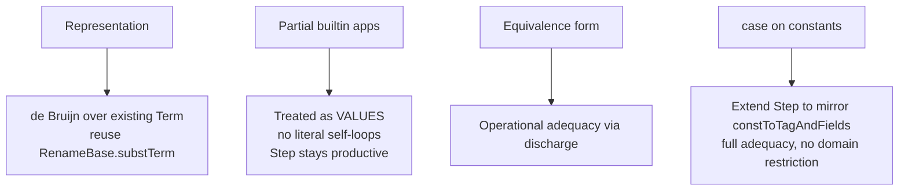
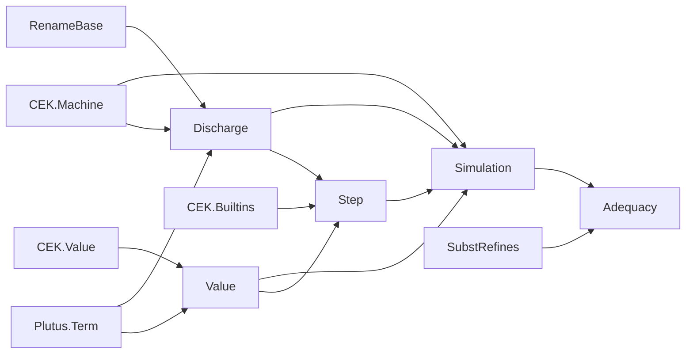

# Small-step UPLC semantics ↔ CEK machine: port & equivalence plan

## STATUS: COMPLETE ✅

The full bidirectional adequacy is proven and compiles (`Moist.Verified.SmallStep`,
17 modules, no `sorry`/`admit`/`axiom`). The headline theorems
(`Moist/Verified/SmallStep/Adequacy.lean`), for any closed canonical `Term` `t`:

- `adequacy_halt` : `(∃ v, Reaches (init t) (.halt v)) ↔ (∃ w, Steps t w ∧ Value w)`
- `adequacy_error`: `Reaches (init t) .error ↔ ∃ w, Steps t w ∧ Stuck w`
- `adequacy_halt_fwd` : exact-value forward
  (`Reaches (init t) (.halt v) → Steps t (discharge v) ∧ Value (discharge v)`)

`#print axioms` on all of these reports only `[propext, Classical.choice, Quot.sound]`
— no `sorryAx`. `Step` is proven deterministic (`step_det`).

## Executable, SMT/Blaster-friendly presentation (`Executable.lean`)

The `Step`/`Steps`/`Value` relations are `Prop`s, so an SMT backend (Blaster) has
nothing to unfold or execute on them. `Moist/Verified/SmallStep/Executable.lean`
(~908 lines, axiom-clean) adds a *functional* presentation of the same semantics
and proves it equivalent, so Blaster can symbolically execute it like the CEK `exec`.

Functions (all total):
- `isValue : Term → Bool` (with `isValueList`, `bspine?`) — decides `Value`.
- `stepF : Term → Option Term` (with `stepFields`/`FieldStep`) — the deterministic
  one-step reducer (`some` = unique reduct, `none` = value-or-stuck).
- `evalF : Nat → Term → Outcome` (`value`/`stuck`/`timeout`) — fuel-driven, the
  substitution-based analogue of the CEK `exec`.

Bridge theorems:
- `isValue_iff` : `isValue t = true ↔ Value t`
- `stepF_some_iff` : `stepF t = some t' ↔ Step t t'`; `stepF_none_iff` : `stepF t = none ↔ Normal t`
- `evalF_value_iff` : `(∃ n, evalF n t = .value w) ↔ (Steps t w ∧ Value w)`
- `evalF_adequacy` : for closed canonical `t`,
  `(∃ n w, evalF n t = .value w) ↔ (∃ v, Reaches (init t) (.halt v))`
  (plus exact-value `evalF_value_of_reaches` / `reaches_of_evalF_value` via `discharge`).

So a Blaster proof of `evalF N t = .value …` certifies CEK halting. Trade-off vs.
the CEK substrate: `evalF`'s state is a flat `Term` (no closures/environments),
but each `stepF` performs a `substTerm` the CEK avoids — the open empirical
question is whether Blaster unfolds `substTerm` as cheaply as CEK env lookups.
Verified usage: `Test/SmallStepExamples.lean` §6. Blaster benchmark template (needs
the full lake+Blaster+zig toolchain): `Test/Onchain/ExecutableSmallStepBlaster.lean`.

### What was built on top of the original port

- **Determinism** (`Determinism.lean`): `step_det`, `firstNonValue_unique` (unique
  CBV decomposition), `step_constr_inv`, length-indexed `StepsN` + `stepsN_align`
  (determinism ⇒ a reduction prefix of a path to a normal form fits inside it).
- **Closedness** (`Closed.lean`): `ClosedValue`/`ClosedEnv` + `discharge_closed`
  (`closedAt_rename`/`closedAt_substTerm` re-proved in the pure cone in `Subst.lean`).
- **Builtin reflect-bridge** (`ReflectBridge.lean`): `discharge_reflect_discharge`
  (round-trip) ⇒ `evalBuiltin_rdv` (running `evalBuiltin` on `reflect∘discharge`-mapped
  args is discharge-invariant), the lemma the `satApply`/`satForce` simulation needs.
- **State invariant** (`Invariant.lean`): combined `GoodValue` (WF spines + closed),
  `GoodState` preserved by `step` (`step_preserves_good`), `evalBuiltin_preserves_good`.
- **Canonicality** (`Canon.lean`): `discharge` normalises `Lam` binder labels to `0`
  and `Constant` annotations to `constType c`; `CanonState` tracks this and is preserved
  (`step_preserves_canon`). Adequacy therefore assumes `t` canonical (real UPLC is).
- **Forward simulation** (`Simulation.lean`): `sim_step` — every CEK step discharges to
  `Steps` (admin = 0, βδ/case/builtin = 1, error-propagation = several) or is a stuck
  config about to `error`. The `dischargeEnv`-distribution lemmas + `dischargeStack_cong`
  /`dischargeStack_stuck` are the evaluation-context infrastructure.
- **Backward termination** (`Measure.lean`): administrative measure `μ` (strictly down
  on every silent transition), structural step classification `step_mu`, and
  `reach_terminal` (well-founded on `(small-step distance, μ)`): a term with a small-step
  normal form makes the CEK reach a terminal state. `normal_form_unique` (from
  determinism) then pins down which terminal.

Note: the development is FFI/Mathlib-free (pure-core cone) so it builds with `lean`
directly; the canonicality assumption (`Canonical t`) is the one added hypothesis,
needed because `discharge` canonicalises the decorative `Lam`/`Constant` annotations.

## Goal

Port the UPLC spec's small-step **contextual reduction** semantics
(`~/io/plutus/doc/plutus-core-spec/untyped-reduction.tex`, Fig. `fig:untyped-reduction`,
with values from `untyped-values.tex`) into this repo over the existing de Bruijn
`Moist.Plutus.Term.Term`, and prove it **operationally adequate** with respect to the
existing CEK machine (`Moist.CEK.step` / `Reaches`).

## Confirmed decisions

## Key reused machinery (already in repo)

- `Moist.CEK.step : State → State` (pure, total), `Reaches`, determinism
  (`reaches_unique`, `steps_trans`), terminal `halt`/`error`.
- `Moist.Verified.RenameBase.substTerm` — total open/decrementing β-substitution;
  `renameTerm`, `shiftRename`; `closedAt` + `closedAt_substTerm`.
- `Moist.Verified.BetaValueRefines` / `SubstRefines` — substitution ≈ CEK env-extend
  (`SubstEnvRef`, `substRefinesR_body`, `value_stack_poly`, `halt_descends_to_baseπ`).
  Backbone for the small-step → CEK direction at β.
- `Moist.CEK.evalBuiltin : BuiltinFun → List CekValue → Option CekValue` (args reversed,
  most-recent-first), `expectedArgs` = spec arity α(b). Single source of truth for builtins.

## New modules (`Moist/Verified/SmallStep/`)

### 1. `Value.lean` — value predicate (spec `V` + well-formed partial apps `A`)

- `BSpine : Term → BuiltinFun → List Term → ExpectedArgs → Prop` — a well-formed *partial*
  builtin spine for `b` with applied arg-terms (application order) and **non-empty remaining**
  `ExpectedArgs`. Mirrors `CekValue.VBuiltin b args ea` (ea always non-empty by type).
  - `builtin : BSpine (.Builtin b) b [] (expectedArgs b)`
  - `app : BSpine t b args (.more .argV rest) → Value v → BSpine (.Apply t v) b (args++[v]) rest`
  - `force : BSpine t b args (.more .argQ rest) → BSpine (.Force t) b args rest`
- `Value : Term → Prop` (mutual with `ValueList`):
  `Constant`, `Delay`, `Lam`, `Constr i args` (all args values), and
  `∃ b args ea, BSpine t b args ea`.

Saturating cases (`ea = .one _`) are deliberately **excluded** from `Value` — they are the
builtin redexes handled in `Step`. Disjointness (`.more` vs `.one`) gives determinism.

### 2. `Discharge.lean` — total discharge + reflect (proof-grade `readback`)

- `discharge : CekValue → Term`, `dischargeEnv`/iterated subst over env (via `substTerm`),
  mutual with list. Total analogue of `readbackValue`.
- `reflect : Term → CekValue` — interpret a value-term as a `CekValue` (empty envs for
  closed closures; spine parse for builtins). Junk on non-values.
- `dischargeResult : Option CekValue → Term := fun | some v => discharge v | none => .Error`.
- Round-trip lemma **`reflect_discharge : reflect (discharge v) = v`** (the builtin bridge).
- `value_discharge : Value (discharge v)` for every `CekValue v`.

### 3. `Step.lean` — small-step relation + closure

`Step : Term → Term → Prop` faithful to `fig:untyped-reduction` (CBV congruence = the
reduction frames + "first applicable rule"):

- **β**: `Value v → Step (.Apply (.Lam x M) v) (substTerm 1 v M)`
- **force/delay**: `Step (.Force (.Delay M)) M`
- **case/constr**: `i < alts.length → ValueList vs → Step (.Case (.Constr i vs) alts) (vs.foldl .Apply alts[i])`
- **case/const** (CEK extension): mirror `constToTagAndFields`.
- **builtin apply (saturating)**: `BSpine t b args (.one .argV) → Value v →
  Step (.Apply t v) (dischargeResult (evalBuiltin b ((args++[v]).reverse.map reflect)))`
- **builtin force (saturating)**: `BSpine t b args (.one .argQ) →
  Step (.Force t) (dischargeResult (evalBuiltin b (args.reverse.map reflect)))`
- **error frames** (`f[error] → error`): one rule per frame (App-left, App-right of value,
  Force, Constr field, Case scrut).
- **congruence** (CBV order): App (fn then arg, arg guarded by `Value`), Force, Constr
  (fields L→R, prefix guarded by `ValueList`), Case (scrutinee only).

`Steps := ReflTransGen Step` (hand-rolled; no Mathlib). Plus `Normal t := ¬∃t', Step t t'`,
`Stuck t := Normal t ∧ ¬ Value t`.

Lemmas: `value_normal : Value t → Normal t`; **determinism** `Step t a → Step t b → a = b`.

### 4. `Simulation.lean` — forward simulation CEK ⇒ small-step

- `dischargeState : State → Term` — discharge a whole CEK state (plug discharged value into
  discharged stack). `compute`/`ret` administrative transitions discharge to **0** small-steps;
  real reductions to **1**.
- `step_simulates : reachable/closed s → Steps (dischargeState s) (dischargeState (step s))`.
- Corollaries: CEK halt ⇒ small-step reaches that value; CEK error ⇒ small-step reaches a
  stuck normal form.

### 5. `Adequacy.lean` — main theorem

For closed `t`, with `init t := State.compute [] .nil t`:

- **`adequacy_halt`**: `Reaches (init t) (.halt v) ↔ Steps t (discharge v) ∧ Value (discharge v)`
- **`adequacy_error`**: `Reaches (init t) .error ↔ ∃ w, Steps t w ∧ Stuck w`

Forward (CEK ⇒ small-step) from `Simulation` + determinism. Backward (small-step ⇒ CEK)
from determinism of both systems + `SubstRefines` backbone + the fact the CEK never gets
stuck except at `halt`/`error` (progress for the CEK).

## Faithfulness notes

- "First applicable rule" / reduction frames ⇒ encoded as value-guarded inductive congruence
  (standard, provably equivalent unique-decomposition CBV).
- Spec `Eval'` multi-return branch `(V|V⃗′)` is vacuous here (`evalBuiltin` returns a single
  value), so omitted; documented.
- CEK conflates genuine `(error)` with stuck ill-typed configs (spec gets stuck), hence the
  error arm targets non-value normal forms rather than literal `Error`.

## Working agreement

All Lean proofs done inline, one lemma at a time, building after each step. No subagents.
Never revert WIP proofs; clank through errors one by one.
