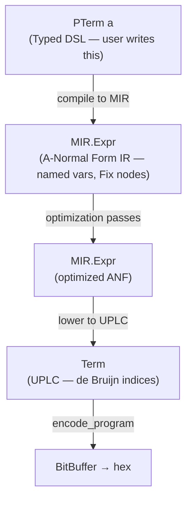

# Moist DSL Implementation Plan: MIR & Compilation Pipeline

## 1. Architectural Overview

The current Moist DSL (`PTerm`) compiles directly to UPLC `Term` nodes via de Bruijn level functions. This works for simple cases but provides no room for optimization and makes the DSL harder to extend. We introduce a **three-layer compilation pipeline**:



**Why three layers?**

| Layer | Concern | Representation |
|---|---|---|
| PTerm | Type safety, user ergonomics | Lean-level types, typeclasses |
| MIR | Optimization, analysis | Named variables, ANF, explicit Fix |
| Term (UPLC) | Serialization, on-chain execution | De Bruijn indices, flat encoding |

The current architecture (`PTerm → Term` directly) collapses the first two layers. By separating them, we gain:
- Named variables in MIR make transformations (inlining, CSE, DCE) straightforward — no de Bruijn arithmetic
- ANF guarantees all intermediate values are named, so optimization passes can inspect/rewrite them
- `Fix` as a first-class node enables recursion-specific optimizations without pattern-matching on combinator encodings
- The lowering to UPLC can choose between different strategies (Z combinator variants, hoisting policies) independently from the DSL

---

## 2. MIR Design: A-Normal Form with Fix

### 2.1 Core Types

```lean
namespace Moist.MIR

/-- Unique variable identifier. Carries optional debug hint. -/
structure VarId where
  uid  : Nat
  hint : String := ""
deriving BEq, Hashable, Repr

/-- Fresh variable supply monad. -/
abbrev FreshM := StateM Nat

def freshVar (hint : String := "") : FreshM VarId := do
  let n ← get
  set (n + 1)
  pure ⟨n, hint⟩

/-- Atoms: trivial expressions.
    Always cheap to duplicate. Never cause side effects.
    These are the only things allowed as arguments
    in application/force/constr positions under ANF. -/
inductive Atom
  | Var     : VarId → Atom
  | Lit     : Const × BuiltinType → Atom
  | Builtin : BuiltinFun → Atom
deriving Repr, BEq

/-- MIR Expressions — the core IR in A-Normal Form.

    ANF invariant: in App, Force, Constr, and Case,
    operand positions hold only Atoms.
    Any complex sub-expression that feeds into these
    positions must be let-bound first. -/
inductive Expr
  -- Values / terminals
  | Atom    : Atom → Expr                          -- return an atomic value
  | Lam     : VarId → Expr → Expr                  -- λx. body
  | Delay   : Expr → Expr                          -- delay(e)
  | Error   : Expr                                  -- ⊥

  -- Let bindings (the spine of ANF)
  | Let     : VarId → Expr → Expr → Expr           -- let x = rhs in body
  | LetRec  : List (VarId × Expr) → Expr → Expr    -- letrec x₁=e₁ ... xₙ=eₙ in body

  -- ANF-normalized eliminators (arguments are Atoms)
  | App     : Atom → Atom → Expr                   -- f x
  | Force   : Atom → Expr                          -- force(a)
  | Constr  : Nat → List Atom → Expr               -- Constr(tag, a₁...aₙ)
  | Case    : Atom → List Expr → Expr              -- case a of [alt₁...altₙ]

  -- Fixed point (first-class recursion)
  | Fix     : VarId → Expr → Expr                  -- fix f = body
                                                    -- (f is bound in body,
                                                    --  body is typically a Lam)
deriving Repr
```

### 2.2 The ANF Invariant

In standard lambda calculus, you can write `f (g x) (h y)`. In ANF, this becomes:

```
let t₁ = g x in
let t₂ = h y in
f t₁ t₂
```

Every intermediate result is named. This makes the evaluation order explicit and gives every sub-computation a handle for optimization passes to inspect.

**What counts as "atomic" (no let-binding needed):**
- Variables (`Atom.Var`)
- Literal constants (`Atom.Lit`)
- Builtin function references (`Atom.Builtin`)

**What must be let-bound:**
- Applications (`App f x`)
- Force (`Force a`)
- Lambda bodies when used as arguments
- Constructor applications (sometimes — see below)

**Relaxation for values:** `Lam` and `Delay` are values (already evaluated), so they *can* appear as let RHS without implying computation. We allow `Let x (Lam ...) body` for sharing lambda values.

### 2.3 The Fix Node

`Fix f body` represents a fixed-point binding where `f` is bound within `body` as a self-reference.

**Semantics:**
```
Fix f (Lam x e) ≡ the function g where g(x) = e[f ↦ g]
```

This is equivalent to `letrec f = λx. e in f` or, in combinator form, `Z (λf. λx. e)`.

**Why first-class Fix instead of encoding as Z combinator in the DSL?**

1. **Optimization visibility**: With Fix as a node, passes can detect recursion structurally. Tail recursion detection becomes "is the Fix-bound var in tail position of body?" rather than pattern-matching on `(λr. ...) (λr. ...)`.

2. **Flexible lowering**: The Z combinator has multiple encodings with different size/speed tradeoffs (Plutarch has three: `pfixHoisted`, `pfix`, `pfixInline`). By keeping Fix abstract in MIR, we can choose the encoding at lowering time based on context (is the function hoisted? called once? in a tight loop?).

3. **Mutual recursion**: `LetRec` generalizes Fix to multiple bindings. Having both gives us `Fix` for the common single-recursion case (cleaner, more optimizable) and `LetRec` for the general case.

4. **Future extensions**: Unrolling, specialization, known-call optimization, and tail-call-to-loop transformation all become straightforward with explicit Fix.

**Fix variants we want to support:**

| Pattern | Meaning | Example |
|---|---|---|
| `Fix f (Lam x body)` | Recursive function | Factorial, list fold |
| `Fix f (Lam x (Lam y body))` | Multi-arg recursive function | Binary search, zip |
| `LetRec [(f, Lam ...), (g, Lam ...)] body` | Mutual recursion | Even/odd predicates |

### 2.4 Multi-argument Application

UPLC is curried: `f x y` is `App (App f x) y`. In ANF, multi-argument application requires intermediate lets:

```
let t = f x in
t y
```

This is correct but verbose. We could add a convenience `AppN : Atom → List Atom → Expr` that desugars to chained `Let`/`App`, but keeping the primitive form simple is better for optimization passes (each intermediate partial application is visible for analysis).

**Decision:** Keep `App : Atom → Atom → Expr` as the primitive. Provide a smart constructor `appN` that generates the let chain.

### 2.5 Comparison with Plutarch's RawTerm

| Plutarch RawTerm | MIR Expr | Notes |
|---|---|---|
| `RVar Word64` | `Atom (Atom.Var id)` | Named instead of de Bruijn |
| `RLamAbs Word64 RawTerm` | `Lam x body` | Single-arg (arity tracked separately if needed) |
| `RApply RawTerm [RawTerm]` | `Let` + `App` chains | ANF forces naming intermediates |
| `RForce` | `Force` | Same |
| `RDelay` | `Delay` | Same |
| `RConstant` | `Atom (Atom.Lit ...)` | Same |
| `RBuiltin` | `Atom (Atom.Builtin ...)` | Same |
| `RError` | `Error` | Same |
| `RHoisted HoistedTerm` | (decided at lowering) | MIR doesn't have hoisting — it's a lowering concern |
| `RConstr` | `Constr` | Same but with atomic args |
| `RCase` | `Case` | Same but scrutinee is atomic |
| (no equivalent) | `Fix` | First-class in MIR |
| (no equivalent) | `LetRec` | First-class in MIR |
| (no equivalent) | `Let` | ANF makes all bindings explicit |

---

## 3. PTerm Redesign: Targeting MIR

### 3.1 Current Problem

The current PTerm:
```lean
inductive PTerm' (t : Type) : Type where
  | toTerm : (Nat → Option Term) → PTerm' t
```

Problems:
- Directly produces UPLC `Term` — no room for optimization
- De Bruijn levels are baked in — transformations are error-prone
- No distinction between "this should be shared" vs "this should be inlined"
- `PlutusType` instances all return `none` — the current design doesn't support real data construction

### 3.2 New PTerm Design

```lean
/-- A typed Plutus term that compiles to MIR.
    The FreshM monad supplies unique variable IDs. -/
inductive PTerm' (t : Type) : Type where
  | mk : FreshM Expr → PTerm' t
```

Key change: instead of `Nat → Option Term`, we now produce `FreshM Expr` — a monadic computation that generates MIR with fresh variable names.

**Alternatively** (simpler incremental path):

```lean
/-- PTerm as before, but compiles to MIR. -/
inductive PTerm' (t : Type) : Type where
  | mk : (Nat → Expr) → PTerm' t
```

This keeps the level-passing style but targets MIR. The `Nat` would be used only for generating fresh variable IDs (not de Bruijn indexing). Variables are always named, not positional.

**Decision point: Which approach?**

| Aspect | `FreshM Expr` | `Nat → Expr` |
|---|---|---|
| Purity | Monadic | Pure (easier to reason about) |
| Fresh names | Via StateM | Level becomes the unique seed |
| Composition | Need monadic bind | Function composition |
| Current code delta | Larger rewrite | Smaller delta from current `Nat → Option Term` |

**Recommendation:** Start with `Nat → Expr` to minimize disruption, migrate to `FreshM Expr` later if needed. The `Nat` parameter serves double duty as both fresh name supply and (for some internal bookkeeping) scope depth.

### 3.3 Core DSL Operations on New PTerm

```lean
def plam' [PlutusType a] [PlutusType b]
    (f : PTerm a → PTerm b) : PTerm (a → b) :=
  PTerm'.mk (fun i =>
    let x := VarId.mk i "arg"
    let v : PTerm a := PTerm'.mk (fun _ => Expr.Atom (Atom.Var x))
    let body := runPTerm (i + 1) (f v)
    Expr.Lam x body
  )

def papp' [PlutusType a] [PlutusType b]
    (f : PTerm (a → b)) (x : PTerm a) : PTerm b :=
  PTerm'.mk (fun i =>
    let fExpr := runPTerm i f
    let xExpr := runPTerm i x
    -- ANF: if f or x aren't atomic, let-bind them
    anfApp i fExpr xExpr
  )

/-- ANF-normalize an application: ensure both operands are Atoms. -/
private def anfApp (i : Nat) (f x : Expr) : Expr :=
  let (fAtom, fWrap) := ensureAtom i f
  let (xAtom, xWrap) := ensureAtom (i + 1) x  -- +1 if fWrap used a name
  fWrap (xWrap (Expr.App fAtom xAtom))

/-- If the expression is already an Atom, return it.
    Otherwise, let-bind it and return the variable. -/
private def ensureAtom (i : Nat) (e : Expr) : Atom × (Expr → Expr) :=
  match e with
  | Expr.Atom a => (a, id)
  | _ =>
    let x := VarId.mk i "anf"
    (Atom.Var x, fun body => Expr.Let x e body)

def pfix' [PlutusType a] [PlutusType b]
    (f : PTerm (a → b) → PTerm (a → b)) : PTerm (a → b) :=
  PTerm'.mk (fun i =>
    let self := VarId.mk i "fix"
    let selfTerm : PTerm (a → b) := PTerm'.mk (fun _ => Expr.Atom (Atom.Var self))
    let body := runPTerm (i + 1) (f selfTerm)
    Expr.Fix self body
  )

def plet' [PlutusType a] [PlutusType b]
    (v : PTerm a) (f : PTerm a → PTerm b) : PTerm b :=
  PTerm'.mk (fun i =>
    let x := VarId.mk i "let"
    let rhs := runPTerm i v
    let xTerm : PTerm a := PTerm'.mk (fun _ => Expr.Atom (Atom.Var x))
    let body := runPTerm (i + 1) (f xTerm)
    Expr.Let x rhs body
  )

def pdelay [PlutusType a] (t : PTerm a) : PTerm (Delayed a) :=
  PTerm'.mk (fun i => Expr.Delay (runPTerm i t))

def pforce [PlutusType a] (t : PTerm (Delayed a)) : PTerm a :=
  PTerm'.mk (fun i =>
    let inner := runPTerm i t
    let (atom, wrap) := ensureAtom i inner
    wrap (Expr.Force atom)
  )

def perror [PlutusType r] : PTerm r :=
  PTerm'.mk (fun _ => Expr.Error)

def pcon [PlutusType t] (x : t) : PTerm t :=
  PTerm'.mk (fun i =>
    -- Delegates to PlutusType.pcon' which produces MIR
    runPTerm i (PlutusType.pcon' x)
  )

def pmatch [PlutusType t] [PlutusType r]
    (x : PTerm t) (f : t → PTerm r) : PTerm r :=
  PTerm'.mk (fun i =>
    runPTerm i (PlutusType.pmatch' x f)
  )
```

### 3.4 Compilation Entry Point

```lean
def compile [PlutusType a] (t : PTerm a) : Program :=
  let mir := runPTerm 0 t
  let optimized := MIR.optimize mir
  let uplc := MIR.lower optimized
  Program.Program (Version.Version 1 1 0) uplc
```

---

## 4. MIR → UPLC Lowering

### 4.1 The Core Translation

Lowering converts named-variable MIR to de Bruijn-indexed UPLC `Term`. It handles:

1. **Variable resolution**: Map `VarId` → de Bruijn index using an environment
2. **Fix lowering**: Convert `Fix` nodes to Z combinator applications
3. **LetRec lowering**: Encode mutual recursion
4. **Let elimination**: Convert `Let x rhs body` to `App (Lam _ body) rhs`
5. **ANF flattening**: Already in correct form for UPLC

```lean
namespace MIR.Lower

/-- Environment mapping VarIds to their de Bruijn depth. -/
abbrev Env := List VarId  -- stack: head is innermost binding

def lookupVar (env : Env) (v : VarId) : Option Nat :=
  env.findIdx? (· == v)  -- index from top of stack = de Bruijn index

/-- Lower MIR Expr to UPLC Term. -/
partial def lower (env : Env) : Expr → Option Term
  | Expr.Atom (Atom.Var v) => do
      let idx ← lookupVar env v
      pure (Term.Var (idx + 1))  -- UPLC de Bruijn is 1-indexed

  | Expr.Atom (Atom.Lit c) =>
      pure (Term.Constant c)

  | Expr.Atom (Atom.Builtin b) =>
      pure (Term.Builtin b)

  | Expr.Lam x body => do
      let body' ← lower (x :: env) body
      pure (Term.Lam 0 body')

  | Expr.App f x => do
      let f' ← lowerAtom env f
      let x' ← lowerAtom env x
      pure (Term.Apply f' x')

  | Expr.Let x rhs body => do
      -- let x = rhs in body  ≡  (λx. body) rhs
      let rhs' ← lower env rhs
      let body' ← lower (x :: env) body
      pure (Term.Apply (Term.Lam 0 body') rhs')

  | Expr.Force a => do
      let a' ← lowerAtom env a
      pure (Term.Force a')

  | Expr.Delay e => do
      let e' ← lower env e
      pure (Term.Delay e')

  | Expr.Constr tag atoms => do
      let args ← atoms.mapM (lowerAtom env)
      pure (Term.Constr tag args)

  | Expr.Case a alts => do
      let a' ← lowerAtom env a
      let alts' ← alts.mapM (lower env)
      pure (Term.Case a' alts')

  | Expr.Fix f body =>
      -- Z combinator: fix f = (λs. body'[f ↦ λv. s s v]) (λs. body'[f ↦ λv. s s v])
      lowerFix env f body

  | Expr.Error => pure Term.Error

  | Expr.LetRec binds body =>
      lowerLetRec env binds body
```

### 4.2 Fix Lowering Strategies

The Z combinator has multiple encodings. We parameterize:

```lean
inductive FixStrategy
  | ZCombinator      -- (λs. f' (λv. s s v)) (λs. f' (λv. s s v)) — standard, strict-safe
  | ZInline          -- (λs. body[f:=λv. s s v]) (λs. body[f:=λv. s s v]) — duplicates body
  | ZCompact         -- (λr. r r) (λr. body[f:=λv. r r v]) — smaller but extra beta-redex
```

**ZCombinator** (default, matches Plutarch's `pfixHoisted`):
```
Fix f (Lam x e) →
  let inner = λs. (λf. λx. e) (λv. s s v)
  (inner) (inner)
```

**ZInline** (matches Plutarch's `pfixInline` — faster but larger):
```
Fix f (Lam x e) →
  let inner = λs. e[f := λv. s s v]
  (inner) (inner)
```

**ZCompact** (matches Plutarch's `pfix` — smallest non-hoisted):
```
Fix f (Lam x e) →
  (λr. r r) (λr. e[f := λv. r r v])
```

The choice can be made per-Fix based on heuristics (code size, call frequency) or global configuration.

### 4.3 Let Lowering Options

`Let x rhs body` can be lowered as:

1. **Lambda application** (default): `(λx. body) rhs` — always correct
2. **Inline** (optimization): substitute `rhs` directly into `body` — only safe if `rhs` is pure and used once (or is trivial)

The optimization passes in Section 5 decide which lets to inline *before* lowering, so by the time we lower, the remaining Lets are genuinely needed and we use strategy 1.

---

## 5. Optimization Passes

All passes operate on `MIR.Expr` and return `MIR.Expr`. They preserve semantics. Each pass is a function `Expr → Expr`.

### 5.1 Analysis Infrastructure

Before running passes, we need analysis utilities:

```lean
/-- Free variables of an expression. -/
def freeVars : Expr → HashSet VarId

/-- Count occurrences of a variable in an expression. -/
def countUses (v : VarId) : Expr → Nat

/-- Is this expression trivial (an Atom)? -/
def isTrivial : Expr → Bool

/-- Is this expression a value (Atom, Lam, or Delay)? -/
def isValue : Expr → Bool

/-- Substitute v ↦ replacement in expr (capture-avoiding). -/
def subst (v : VarId) (replacement : Expr) : Expr → Expr

/-- Size of an expression (node count). -/
def exprSize : Expr → Nat
```

### 5.2 Pass: Inline Trivial Lets

```
Let x (Atom a) body  →  body[x := Atom a]
```

Atoms are always safe to inline: they're pure and cheap to duplicate.

### 5.3 Pass: Dead Code Elimination

```
Let x rhs body  →  body    (when x ∉ freeVars(body))
```

Remove bindings whose result is never used. For `LetRec`, remove individual bindings that aren't referenced by any surviving binding or the body.

### 5.4 Pass: Beta Reduction

```
Let x (Lam y lamBody) body  →  body[x := Lam y lamBody]
    when countUses(x, body) = 1
```

Inline a lambda that's used exactly once. Also:

```
App (Lam y body) (Atom a)  →  Let y (Atom a) body
```

When the argument to an application is atomic, we can substitute directly (or let the trivial-let pass handle it).

### 5.5 Pass: Force/Delay Cancellation

```
Let x (Delay e) body  →  body[Force(Var x) := e]
    when every use of x is inside Force
```

Or more directly, in the `Force`/`Delay` interaction:

```
Force (Var x)  where x is bound to Delay(e)  →  (inline e)
```

Operationally: if we see `Let x (Delay e) (... Force (Var x) ...)` and `x` is only used under `Force`, replace with `Let x e (... Var x ...)`.

### 5.6 Pass: Constant Folding

Evaluate known builtin applications at compile time:

```
Let x (App (App (Builtin AddInteger) (Lit 3)) (Lit 5)) body
  →  Let x (Atom (Lit 8)) body
```

This requires implementing a subset of the CEK machine for pure builtins. Start with:
- Arithmetic: `AddInteger`, `SubtractInteger`, `MultiplyInteger`
- Comparison: `EqualsInteger`, `LessThanInteger`, etc.
- Boolean: `IfThenElse` with known condition

### 5.7 Pass: Case of Known Constructor

```
Case (Constr i args) [alt₀, alt₁, ..., altₙ]  →  altᵢ (with args bound)
```

When the scrutinee is a known constructor, select the appropriate alternative directly.

### 5.8 Pass: Common Subexpression Elimination (CSE)

```
Let x e₁ (Let y e₂ body)  →  Let x e₁ body[y := x]
    when e₁ ≡ e₂ (structurally equal)
```

Named variables in ANF make this easy: every intermediate result has a name, so we can compare expressions structurally and merge identical ones.

### 5.9 Pass: Fix-Specific Optimizations

#### 5.9.1 Tail Recursion Detection

A recursive call `f args` in `Fix f (Lam x body)` is in **tail position** if it's the last operation — not wrapped in further computation.

```
Fix f (Lam x (... if cond then base else App (Var f) arg))
```

When detected, we can:
- Mark it for potential loop encoding (future: if UPLC ever supports it)
- Avoid the overhead of the self-application in the Z combinator by using a tighter encoding
- Inform the lowering strategy choice

#### 5.9.2 Known-Call Specialization

If `Fix f body` and `f` is only called with arguments matching a known pattern, we can specialize the body.

#### 5.9.3 Loop Unrolling

For small recursive functions called a known number of times, unroll:

```
Fix f (Lam x (if x == 0 then base else ... f (x-1) ...))
```

When called with a small constant, inline the recursion.

### 5.10 Pass: Let Floating

**Float-in**: Move lets closer to their use site (reduces live variable pressure):
```
Let x rhs (Case a [... uses x ..., ... no x ...])
  →  Case a [... Let x rhs (uses x) ..., ... no x ...]
```

**Float-out**: Move lets out of lambdas (enables sharing):
```
Lam y (Let x rhs body)  →  Let x rhs (Lam y body)
    when y ∉ freeVars(rhs)
```

### 5.11 Pass Pipeline

Run passes in a fixed order, iterate until no changes:

```lean
def optimizationPipeline : List (Expr → Expr) :=
  [ inlineTrivialLets
  , deadCodeElim
  , betaReduce
  , forceDelayCancel
  , constantFold
  , caseOfKnownConstr
  , cse
  , fixOptimizations
  , letFloat
  ]

def optimize (e : Expr) : Expr :=
  let rec loop (fuel : Nat) (e : Expr) :=
    match fuel with
    | 0 => e
    | n + 1 =>
      let e' := optimizationPipeline.foldl (fun acc pass => pass acc) e
      if e' == e then e  -- fixpoint reached
      else loop n e'
  loop 10 e  -- max 10 iterations
```

---

## 6. Hoisting (Shared Subterm Extraction)

Plutarch's hoisting is a critical optimization: common subterms (like `phoistAcyclic $ plam $ \x -> ...`) are compiled once and referenced by index. This saves on-chain script size.

In MIR, hoisting is a **lowering concern**, not an IR feature. The process:

1. After optimization, walk the MIR tree and identify closed sub-expressions (no free variables) that appear multiple times
2. Extract them into top-level definitions
3. During UPLC lowering, wrap the program in lambda-application pairs that bind the hoisted terms

```lean
/-- A hoisted definition: closed expression extracted for sharing. -/
structure HoistedDef where
  id   : Nat
  expr : Expr  -- closed (no free variables)
  hash : UInt64

/-- Identify hoist candidates in an expression. -/
def findHoistCandidates (e : Expr) : List HoistedDef

/-- Replace hoisted sub-expressions with variable references. -/
def applyHoisting (defs : List HoistedDef) (e : Expr) : Expr

/-- Wrap the body in lambda-applications for each hoisted def.
    Result: (λh₁. (λh₂. ... body) def₂) def₁ -/
def wrapHoisted (defs : List HoistedDef) (body : Term) : Term
```

**Inlining policy** (matches Plutarch):
- Sub-expressions used exactly once: always inline (no benefit to hoisting)
- Small constants/builtins: always inline
- Everything else used 2+ times: hoist

---

## 7. File Organization

```
Moist/
├── Basic.lean                -- (existing) shared helpers
├── Plutus/
│   ├── Term.lean             -- (existing) UPLC AST
│   ├── Encode.lean           -- (existing) flat encoder
│   ├── Decode.lean           -- (existing) flat decoder
│   ├── BitBuffer.lean        -- (existing) bit manipulation
│   ├── CBOR.lean             -- (existing) CBOR for Data
│   ├── Lemma.lean            -- (existing) helper theorems
│   └── Moist.lean            -- (existing → rewrite) PTerm DSL, PlutusType
├── MIR/
│   ├── Expr.lean             -- MIR types: VarId, Atom, Expr
│   ├── Pretty.lean           -- Pretty-printer for MIR (debugging)
│   ├── Analysis.lean         -- freeVars, countUses, subst, exprSize
│   ├── ANF.lean              -- A-normalization helpers (ensureAtom, anfApp)
│   ├── Optimize.lean         -- All optimization passes + pipeline
│   ├── Lower.lean            -- MIR → UPLC lowering (including Fix strategies)
│   └── Hoist.lean            -- Hoisting analysis and extraction
└── Test/
    ├── MIR.lean              -- MIR round-trip and optimization tests
    └── DSL.lean              -- End-to-end DSL compilation tests
```

---

## 8. Implementation Phases

### Phase 1: MIR Foundation
**Goal:** Define MIR types, pretty-printer, and basic analysis. No integration with PTerm yet.

- [ ] Define `VarId`, `Atom`, `Expr` in `Moist/MIR/Expr.lean`
- [ ] Implement `freeVars`, `countUses`, `subst`, `exprSize` in `Moist/MIR/Analysis.lean`
- [ ] Implement pretty-printer in `Moist/MIR/Pretty.lean`
- [ ] Write manual MIR expressions and verify they look correct
- [ ] Implement `MIR.Lower.lower` (MIR → UPLC Term) with basic Fix lowering (Z combinator)
- [ ] Test: hand-write MIR for simple programs, lower to Term, encode, compare with known hex

### Phase 2: PTerm → MIR Compilation
**Goal:** Rewrite PTerm internals to target MIR instead of UPLC Term.

- [ ] Change `PTerm'` to produce `Expr` instead of `Term`
- [ ] Rewrite `plam'`, `papp'`, `plet'`, `perror` to produce MIR nodes
- [ ] Implement `pfix'` producing `Expr.Fix`
- [ ] Implement `pforce`, `pdelay` producing MIR nodes
- [ ] Implement `punsafeBuiltin` producing `Atom.Builtin`
- [ ] Wire up compilation: `PTerm.compile` → MIR → lower → UPLC → encode
- [ ] Re-verify existing test: `plam bob` should produce same hex output
- [ ] ANF helpers (`ensureAtom`, `anfApp`) in `Moist/MIR/ANF.lean`

### Phase 3: Basic Optimization Passes
**Goal:** Implement the "low-hanging fruit" optimizations.

- [ ] Inline trivial lets
- [ ] Dead code elimination
- [ ] Force/delay cancellation
- [ ] Beta reduction (single-use lambdas)
- [ ] Build the pass pipeline with iteration
- [ ] Test each pass individually on hand-crafted MIR
- [ ] Test pipeline end-to-end: verify optimized programs are smaller but semantically equivalent

### Phase 4: Advanced Optimization Passes
**Goal:** Implement the more sophisticated passes.

- [ ] Constant folding (requires partial evaluator for pure builtins)
- [ ] Case-of-known-constructor
- [ ] Common subexpression elimination
- [ ] Let floating (in and out)
- [ ] Fix-specific: tail recursion detection + strategy selection
- [ ] Hoisting analysis and extraction

### Phase 5: PlutusType Instances & Data Support
**Goal:** Make `pcon`/`pmatch` actually work for real types.

- [ ] Implement `PlutusType` for primitive types (Integer, Bool, ByteString, Unit, String)
  - `pcon'` produces `Expr.Atom (Atom.Lit ...)`
  - `pmatch'` uses builtins (IfThenElse for Bool, etc.)
- [ ] Implement `PlutusType` for `Data` using Constr/Case
- [ ] Implement `PlutusType` for sum types (Scott encoding or SoP via Constr/Case)
- [ ] Design deriving macros for custom types

### Phase 6: Builtin Wrappers & Prelude
**Goal:** Ergonomic wrappers for all UPLC builtins.

- [ ] Arithmetic: `padd`, `psub`, `pmul`, `pdiv`, `pmod`, etc.
- [ ] Comparison: `peq`, `plt`, `plte`, etc.
- [ ] ByteString: `pappendBS`, `pconsBS`, `psliceBS`, etc.
- [ ] String: `pappendStr`, `pencodeUtf8`, `pdecodeUtf8`
- [ ] List: `phead`, `ptail`, `pnull`, `pcons`, `pchooseList`
- [ ] Data: `pconstrData`, `pmapData`, `plistData`, `piData`, `pbData`
- [ ] Crypto: `psha2_256`, `pblake2b_256`, `pverifyEd25519Signature`, etc.
- [ ] Control: `pif`, `ptrace`, `pchooseUnit`
- [ ] Re-export everything from `Moist.Plutus.Prelude`

---

## 9. Open Design Questions

These need resolution before or during implementation:

1. **Should `PTerm'` use `Nat → Expr` or `FreshM Expr`?**
   - `Nat → Expr` is simpler, closer to current code, and keeps the pure-function style
   - `FreshM Expr` is cleaner for complex elaboration (LetRec, multi-binder macros)
   - Recommendation: start with `Nat → Expr`, migrate if needed

2. **Should Lam track arity?**
   - Plutarch's `RLamAbs` carries a `Word64` arity for multi-arg lambdas merged into one node
   - This saves code size but complicates the IR
   - Recommendation: keep single-arg Lam in MIR; merge during lowering if beneficial

3. **How to handle the `s` phantom type / closed term guarantee?**
   - Plutarch uses `forall s. Term s a` to ensure terms are closed
   - In Lean, we can use universe polymorphism or a simpler "all VarIds must be bound" check
   - Recommendation: for now, validate at compile time (check freeVars = ∅); add type-level guarantees later

4. **Hoisting: at MIR level or UPLC level?**
   - At MIR level: more info available, can hoist before optimization
   - At UPLC level: simpler, matches Plutarch's approach
   - Recommendation: hoist after optimization, before lowering (a "pre-lowering" MIR pass that inserts top-level Lets)

5. **How aggressive should constant folding be?**
   - Minimal: only arithmetic on small literals
   - Moderate: + boolean ops, comparisons, string/bytestring concatenation
   - Full: run a MIR interpreter for pure sub-expressions
   - Recommendation: start moderate, add full evaluator later

6. **Should LetRec support non-function bindings?**
   - In lazy languages, `letrec x = (1, x)` makes sense
   - UPLC is strict — `letrec` only makes sense for lambdas (thunks via Delay are also possible)
   - Recommendation: restrict `LetRec` bindings to `Lam` or `Delay` forms; reject others at validation time

7. **Should we split Expr into separate Value/Computation types for stronger ANF guarantees?**
   - Two-level split: `Value = Atom | Lam | Delay`, `Comp = App | Force | Constr | ...`, `Expr = Let Var Comp Expr | Value | Case ...`
   - This makes the ANF invariant enforced by the type system, not just by convention
   - Tradeoff: more types to juggle, pattern matching becomes more nested
   - Recommendation: start with single `Expr` type, add the split if we find bugs due to ANF violations
