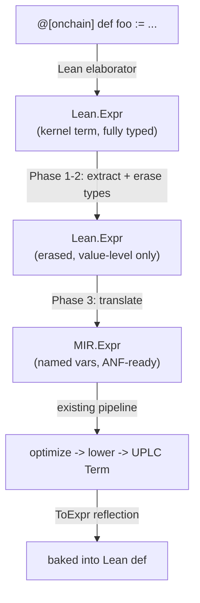
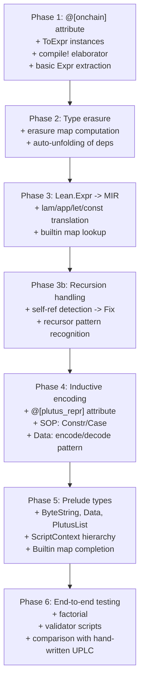

# PlutusTx-Style Metaprogramming: Lean Expr to UPLC

## Overview

Compile a subset of normal Lean 4 code to UPLC via metaprogramming.
The user writes regular Lean definitions, annotates them with `@[onchain]`,
and uses `compile!` (a term elaborator) to produce UPLC `Term` values
at elaboration time. The result is a regular Lean definition — exportable
to other modules, usable in downstream code.



## User-Facing API

```lean
import Moist.Onchain

-- Plutus-compatible subset of Lean
@[onchain]
def factorial (n : Integer) : Integer :=
  if n == 0 then 1
  else n * factorial (n - 1)

-- Helper used by an @[onchain] def — auto-unfolded
def double (x : Integer) : Integer := x + x

@[onchain]
def quadruple (x : Integer) : Integer := double (double x)

-- compile! is a term elaborator: runs the full pipeline at elaboration
-- time and produces a concrete Term value baked into the definition.
def factorialUPLC : Term := compile! factorial
def quadrupleUPLC : Term := compile! quadruple

-- These are regular Lean definitions — importable from other modules,
-- usable in downstream code (encoding, testing, etc.)
def factorialHex : String := encodeProgram factorialUPLC
```

### Why `compile!` Instead of `#compile`

| | `#compile` (command) | `compile!` (term elaborator) |
|---|---|---|
| Produces | Log output (side effect) | A value of type `Term` |
| Assignable to `def` | No | Yes |
| Exportable across modules | No | Yes — it's a regular constant |
| Composable | No | Yes — pipe into encoder, tests, etc. |
| MetaM access | Yes (command context) | Yes (term elaboration context) |

The `compile!` approach makes compiled UPLC a first-class Lean value.

---

## Phase 1: Attribute Registration, ToExpr, and `compile!` Elaborator

### 1.1 The `@[onchain]` Attribute

Register a tag attribute that marks definitions as compilable to UPLC.

```lean
import Lean

namespace Moist.Onchain

open Lean

initialize onchainAttr : TagAttribute ←
  registerTagAttribute `onchain
    "Mark a definition for compilation to Plutus UPLC"
    (validate := fun _name => pure ())

end Moist.Onchain
```

When a definition has `@[onchain]`, it is a valid target for `compile!`.
This attribute also serves as the **compilation boundary**: everything
reachable from an `@[onchain]` function is auto-unfolded (see Phase 2).

### 1.2 `ToExpr` Instances for UPLC Types

To reflect a runtime `Term` value back into a `Lean.Expr` (so it can
be baked into a `def`), we need `ToExpr` instances for the entire
UPLC type tree. `ToExpr` converts a Lean value into a `Lean.Expr` that,
when evaluated, reconstructs that value.

```lean
-- Derive ToExpr for all types in the Term tree.
-- Order matters: leaf types first, then types that contain them.
deriving instance ToExpr for AtomicType
deriving instance ToExpr for TypeOperator
deriving instance ToExpr for BuiltinType
deriving instance ToExpr for Const
deriving instance ToExpr for BuiltinFun
deriving instance ToExpr for Term
deriving instance ToExpr for Version
deriving instance ToExpr for Program
```

If `deriving` doesn't work for mutual inductives (`BuiltinType`/`TypeOperator`),
write manual instances:

```lean
mutual
  partial def builtinTypeToExpr : BuiltinType → Lean.Expr
    | .AtomicType t => mkApp (mkConst ``BuiltinType.AtomicType) (toExpr t)
    | .TypeOperator t => mkApp (mkConst ``BuiltinType.TypeOperator) (typeOperatorToExpr t)

  partial def typeOperatorToExpr : TypeOperator → Lean.Expr
    | .TypeList t => mkApp (mkConst ``TypeOperator.TypeList) (builtinTypeToExpr t)
    | .TypePair a b => mkApp2 (mkConst ``TypeOperator.TypePair) (builtinTypeToExpr a) (builtinTypeToExpr b)
end

instance : ToExpr BuiltinType where
  toExpr := builtinTypeToExpr
  toTypeExpr := mkConst ``BuiltinType

instance : ToExpr TypeOperator where
  toExpr := typeOperatorToExpr
  toTypeExpr := mkConst ``TypeOperator
```

### 1.3 The `compile!` Term Elaborator

A term elaborator that runs the full compilation pipeline at elaboration
time and reflects the result back as a Lean expression.

```lean
open Lean Elab Term Meta in
elab "compile!" id:ident : term => do
  let name ← resolveGlobalConstNoOverload id
  let env ← getEnv

  -- Verify @[onchain] attribute
  unless onchainAttr.hasTag env name do
    throwError "{name} is not marked @[onchain]"

  let some ci := env.find? name
    | throwError "unknown constant: {name}"
  let some val := ci.value?
    | throwError "{name} has no definition body (axiom or opaque?)"

  -- Run the full pipeline: erase → translate → optimize → lower
  let erased ← eraseTypes val
  let mir ← exprToMIR name erased
  let opt := Moist.MIR.optimizeExpr mir
  match Moist.MIR.lowerExpr opt with
  | .ok term =>
    -- Reflect the Term value back into a Lean.Expr via ToExpr
    return toExpr term
  | .error e =>
    throwError "compilation of {name} failed: {e}"
```

This makes `compile!` usable in any term position:

```lean
-- As a definition (exportable to other modules)
def myScript : Term := compile! myValidator

-- Inline in an expression
def myHex : String := encodeProgram (compile! myValidator)

-- In a test
#eval do
  let t : Term := compile! factorial
  IO.println (prettyTerm t)
```

### 1.4 Extracting the Full Dependency Graph

For `@[onchain]` definitions, we need to resolve all referenced constants
transitively. The rule:

- If a referenced constant is a **Plutus builtin** (in the builtin map) -> emit `MIR.Builtin`
- If a referenced constant is **another `@[onchain]` def** -> compile separately, reference by name
- If a referenced constant is **a regular Lean def** -> unfold its body inline
- If a referenced constant is **an axiom/opaque/inductive eliminator** -> handle specially or error

```lean
/-- Collect all constants transitively referenced by an expression,
    excluding builtins and already-compiled @[onchain] defs. -/
partial def collectDeps (env : Environment) (e : Lean.Expr)
    (visited : NameSet := {}) : NameSet :=
  e.foldConsts visited fun name acc =>
    if acc.contains name then acc
    else
      let acc := acc.insert name
      match env.find? name with
      | some ci =>
        match ci.value? with
        | some val => collectDeps env val acc
        | none => acc  -- axiom/opaque — will error later if actually needed
      | none => acc
```

**Key design choice**: Everything depended on by an `@[onchain]` function
gets automatically unfolded. There is no need to mark helpers with
`@[onchain]` — only the entry points need the attribute. The compiler
will transitively inline all reachable definitions that aren't builtins.

---

## Phase 2: Type Erasure

Lean's kernel `Expr` is fully typed and dependently typed. UPLC is
untyped. We must erase all type-level and proof-level content.

### 2.1 What Gets Erased

| Lean Expr construct | Action | Example |
|---|---|---|
| `Expr.forallE` (Pi/arrow types) | Erase entirely | `(n : Nat) -> Nat` -> gone |
| `Expr.sort` (Type, Prop, universes) | Erase | `Type 0` -> gone |
| `Expr.lam` where binder is Type/Prop | Skip binder, keep body | `fun (α : Type) (x : α) => x` -> `fun x => x` |
| `Expr.app` applying a type argument | Skip application | `@List.nil Nat` -> `List.nil` |
| `Expr.app` applying a proof argument | Skip application | `@Decidable.decide p inst` -> erase `inst` |
| `Expr.mdata` | Strip metadata, keep inner | |
| `Expr.proj` | Convert to field accessor | `p.1` -> `fstPair p` or `headList` |

### 2.2 Detecting Erasable Arguments

For each function application `f a1 a2 ... an`, we need to know which
`ai` are types/proofs (erasable) vs values (kept).

```lean
/-- For a constant's type, compute which parameter positions are
    computationally irrelevant (types or proofs). -/
def computeErasureMap (type : Lean.Expr) : MetaM (Array Bool) :=
  forallTelescope type fun params _ => do
    params.mapM fun p => do
      let ty ← inferType p
      -- Erase if: it's a Sort (type argument) or a Prop (proof)
      if ← isType ty then return true
      if ← isProp ty then return true
      return false

-- Example: @List.cons : {α : Type} → α → List α → List α
-- Erasure map: [true, false, false]
-- So: @List.cons Nat 42 xs  erases to:  List.cons 42 xs
```

### 2.3 The Erasure Pass

```lean
/-- Erase type and proof arguments from an expression.
    Returns a simplified Lean.Expr with only value-level content. -/
partial def eraseTypes (e : Lean.Expr) : MetaM Lean.Expr := do
  match e with
  | .forallE .. => pure (.const ``Unit [])  -- types erase to unit
  | .sort .. => pure (.const ``Unit [])
  | .mdata _ e => eraseTypes e
  | .lam name ty body bi =>
    let tyTy ← inferType ty
    if (← isType tyTy) || (← isProp tyTy) then
      -- This binder is a type/proof param — skip it,
      -- instantiate body with a dummy
      eraseTypes (body.instantiate1 (.const ``Unit.unit []))
    else
      let body' ← eraseTypes body
      pure (.lam name ty body' bi)
  | .app f a =>
    -- Check if `a` is a type or proof argument
    let fTy ← inferType f
    match fTy with
    | .forallE _ paramTy _ _ =>
      let paramTyTy ← inferType paramTy
      if (← isType paramTyTy) || (← isProp paramTyTy) then
        -- Erase this argument, just recurse on f
        eraseTypes f
      else
        let f' ← eraseTypes f
        let a' ← eraseTypes a
        pure (.app f' a')
    | _ =>
      let f' ← eraseTypes f
      let a' ← eraseTypes a
      pure (.app f' a')
  | .letE name ty val body _ =>
    let val' ← eraseTypes val
    let body' ← eraseTypes body
    pure (.letE name ty val' body' false)
  | .const name us =>
    -- Will be handled during MIR translation (unfold or map to builtin)
    pure (.const name us)
  | _ => pure e
```

---

## Phase 3: Lean Expr to MIR Translation

### 3.1 Translation Context

```lean
structure CompileCtx where
  /-- Map from Lean Name to MIR VarId for local bindings. -/
  locals     : List (Name × VarId)
  /-- The constant currently being compiled (for detecting self-recursion). -/
  selfName   : Option Name := none
  /-- VarId for the self-reference in a recursive def (used with Fix). -/
  selfVar    : Option VarId := none
  /-- Constants already compiled to MIR (for cross-@[onchain] references). -/
  compiled   : NameMap MIR.Expr := {}
  /-- Builtin mapping. -/
  builtins   : NameMap BuiltinFun

abbrev CompileM := ReaderT CompileCtx (ExceptT String FreshM)
```

### 3.2 Core Translation Rules

```lean
partial def translateExpr (e : Lean.Expr) : CompileM MIR.Expr := do
  match e with
  -- Bound variable (de Bruijn) — look up in local context
  | .bvar i =>
    let ctx ← read
    match ctx.locals.get? i with
    | some (_, vid) => pure (.Var vid)
    | none => throw s!"unbound de Bruijn index: {i}"

  -- Free variable — should have been substituted already
  | .fvar id => throw s!"unexpected free variable: {id.name}"

  -- Lambda: create a fresh MIR var, translate body
  | .lam _name _ty body _bi =>
    let v ← freshVar "arg"
    let body' ← withLocal v (translateExpr body)
    pure (.Lam v body')

  -- Application
  | .app f a =>
    let f' ← translateExpr f
    let a' ← translateExpr a
    pure (.App f' a')

  -- Let binding
  | .letE _name _ty val body _ =>
    let v ← freshVar "let"
    let val' ← translateExpr val
    let body' ← withLocal v (translateExpr body)
    pure (.Let [(v, val')] body')

  -- Named constant: unfold, map to builtin, or recursive self-ref
  | .const name _us => translateConst name

  -- Literal
  | .lit (.natVal n) => pure (.Lit (.Integer n, .AtomicType .TypeInteger))
  | .lit (.strVal s) =>
    -- Strings: encode as ByteString for Plutus
    pure (.Lit (.String s, .AtomicType .TypeString))

  -- Projection: structure field access
  | .proj typeName idx e =>
    translateProj typeName idx e

  | _ => throw s!"unsupported Lean.Expr: {e}"
```

### 3.3 Constant Resolution (Auto-Unfolding)

This is the heart of the compiler. When we encounter a `Lean.Expr.const name`,
we must decide what to do:

```lean
partial def translateConst (name : Name) : CompileM MIR.Expr := do
  let ctx ← read
  -- 1. Self-reference? -> Var pointing to Fix binder
  if ctx.selfName == some name then
    match ctx.selfVar with
    | some v => pure (.Var v)
    | none => throw s!"recursive reference to {name} but no Fix binder set up"

  -- 2. Known Plutus builtin?
  if let some b := ctx.builtins.find? name then
    return .Builtin b

  -- 3. Already compiled @[onchain] def?
  if let some mir := ctx.compiled.find? name then
    return mir

  -- 4. Regular Lean def -> unfold and translate
  let env ← -- get environment
  match env.find? name with
  | some ci =>
    match ci.value? with
    | some val =>
      -- Recursion detection: if `name` appears in `val`, set up Fix
      if val.containsConst name then
        translateRecursiveDef name val
      else
        translateExpr val  -- inline the definition body
    | none => throw s!"cannot compile {name}: no definition body (axiom?)"
  | none => throw s!"unknown constant: {name}"
```

### 3.4 Recursive Definition Handling

When we detect a definition that references itself, wrap it in `Fix`:

```lean
partial def translateRecursiveDef (name : Name) (val : Lean.Expr)
    : CompileM MIR.Expr := do
  -- val should be of the form: fun (x : A) => ...body referencing name...
  -- We need to produce: Fix f (Lam x body')
  let fVar ← freshVar name.toString
  -- Translate the body with selfName/selfVar set, so recursive
  -- references to `name` become (Var fVar)
  let body ← withReader (fun ctx => { ctx with
    selfName := some name
    selfVar := some fVar
  }) (translateExpr val)
  pure (.Fix fVar body)
```

The key insight: Lean's kernel Expr for a structurally recursive function
uses `Nat.rec`, `List.rec`, or `WellFounded.fix`. We have two strategies:

**Strategy A: Intercept pre-kernel (preferred)**

Use `Lean.Elab.getConstInfoDefn` during elaboration, before the kernel
compiles away recursion. At this stage, self-references are still
explicit `const` applications. This is what the code above does.

**Strategy B: Recognize recursor patterns**

If we must work with kernel terms, recognize patterns like:
```
@Nat.rec (motive) (base_case) (step : Nat -> recurse -> result) n
```
And reconstruct: `Fix f (Lam n (Case n [base_case, Lam pred (step pred (App f pred))]))`

**Decision**: Strategy A is simpler and more reliable. Use `getConstInfoDefn`
which gives us the pre-compiled definition where recursion is syntactic.

Question: does `getConstInfoDefn.value` contain the pre-kernel form or
post-kernel? Need to verify. If post-kernel, we need Strategy B or to
hook into the elaborator earlier (e.g., a custom `def` command).

---

## Phase 4: Inductive Types and Pattern Matching

### 4.1 Encoding Strategies

Two options for encoding Lean inductives as UPLC:

**SOP Encoding (using UPLC Constr/Case — preferred)**

```
-- Lean:
inductive MyBool | true | false

-- UPLC:
true  = Constr 0 []
false = Constr 1 []
match b | true => e1 | false => e2  =  Case b [e1, e2]
```

**Data Encoding (using Plutus Data type)**

```
-- Lean:
structure TxOutRef where
  txId : ByteString
  idx  : Integer

-- UPLC:
mkTxOutRef id idx = ConstrData 0 [BData id, IData idx]
match ref ... = let fields = sndPair (unConstrData ref)
                let txId = unBData (headList fields)
                let idx  = unIData (headList (tailList fields))
                ...
```

### 4.2 Encoding Selection via Attributes

Define a parametric attribute `@[plutus_repr]` that specifies
how an inductive type should be encoded:

```lean
inductive PlutusRepr
  | sop   -- Use UPLC Constr/Case (efficient, native)
  | data  -- Use Plutus Data encoding (interoperable with on-chain data)
deriving Repr, BEq, DecidableEq

initialize plutusReprAttr : ParametricAttribute PlutusRepr ←
  registerParametricAttribute {
    name := `plutus_repr
    descr := "Specify Plutus encoding: sop or data"
    getParam := fun _name stx => do
      match stx with
      | `(attr| plutus_repr sop)  => pure .sop
      | `(attr| plutus_repr data) => pure .data
      | _ => Lean.Elab.throwUnsupportedSyntax
  }
```

Usage:

```lean
-- Native SOP: efficient, but only usable within on-chain code
@[plutus_repr sop]
inductive Color | Red | Green | Blue

-- Data encoding: interoperable with script context, datum, redeemer
@[plutus_repr data]
structure TxOutRef where
  txId : ByteString
  idx  : Integer

-- Default: if no annotation, use SOP
inductive Maybe (a : Type) | Nothing | Just (val : a)
```

**Default behavior**: If no `@[plutus_repr]` is given, default to `sop`.
Types that come from the Plutus prelude (ScriptContext, TxInfo, etc.)
should be pre-annotated with `@[plutus_repr data]`.

### 4.3 Resolving Encoding at Compile Time

```lean
def getRepr (env : Environment) (typeName : Name) : PlutusRepr :=
  match plutusReprAttr.getParam? env typeName with
  | some r => r
  | none => .sop  -- default

def translateInductiveConstr (typeName : Name) (ctorIdx : Nat)
    (args : List MIR.Expr) : CompileM MIR.Expr := do
  let env ← getEnv
  match getRepr env typeName with
  | .sop =>
    -- Constr tag args
    pure (.Constr ctorIdx args)
  | .data =>
    -- ConstrData tag [encode arg1, encode arg2, ...]
    let encodedArgs ← args.mapM encodeToData
    let argList := mkDataList encodedArgs
    pure (.App (.App (.Builtin .ConstrData)
                     (.Lit (.Integer ctorIdx, .AtomicType .TypeInteger)))
               argList)
```

### 4.4 Pattern Match Translation

Lean compiles pattern matching into `casesOn` applications. We intercept
these and translate based on encoding:

```lean
/-- Recognize casesOn/recOn applications and translate to MIR Case. -/
partial def translateMatch (casesOnName : Name) (args : Array Lean.Expr)
    : CompileM MIR.Expr := do
  -- casesOn args: [motive, scrutinee, alt0, alt1, ...]
  -- (exact layout depends on the inductive)
  let typeName := casesOnName.getPrefix  -- e.g., MyBool from MyBool.casesOn
  let env ← getEnv
  match getRepr env typeName with
  | .sop =>
    let scrut ← translateExpr args[1]!
    let alts ← args[2:].toArray.toList.mapM translateExpr
    pure (.Case scrut alts)
  | .data =>
    -- Data-encoded: need unConstrData + field extraction
    translateDataMatch typeName args
```

### 4.5 Data-Encoded Match

For `@[plutus_repr data]` types, pattern matching becomes:

```
let pair   = unConstrData scrut
let tag    = fstPair pair
let fields = sndPair pair
case tag of
  0 => let f0 = decodeField (headList fields)
       let f1 = decodeField (headList (tailList fields))
       alt0 f0 f1
  1 => ...
```

This is exactly the `dataDeconstructMIR` pattern we already tested,
now generated automatically.

---

## Phase 5: Builtin Mapping and Prelude

### 5.1 Lean-to-Plutus Builtin Map

Map Lean standard library operations to Plutus builtins. Where possible,
reuse Lean's existing types and functions:

```lean
def defaultBuiltinMap : NameMap BuiltinFun := .ofList [
  -- Integer arithmetic (Lean's Int operations)
  (`Int.add,                    .AddInteger),
  (`Int.sub,                    .SubtractInteger),
  (`Int.mul,                    .MultiplyInteger),
  (`Int.div,                    .DivideInteger),
  (`Int.mod,                    .ModInteger),
  (`Int.decEq,                  .EqualsInteger),
  (`Int.decLt,                  .LessThanInteger),
  (`Int.decLe,                  .LessThanEqualsInteger),

  -- BEq instances (these get elaborated to specific function names)
  (`instBEqInt_beq,             .EqualsInteger),

  -- Bool
  (`Bool.true,                  ???),   -- Constr 0 [] (not a builtin)
  (`Bool.false,                 ???),   -- Constr 1 [] (not a builtin)

  -- ByteString operations (need Moist.Prelude.ByteString)
  (`Moist.ByteString.append,    .AppendByteString),
  (`Moist.ByteString.length,    .LengthOfByteString),
  (`Moist.ByteString.cons,      .ConsByteString),
  (`Moist.ByteString.slice,     .SliceByteString),
  (`Moist.ByteString.index,     .IndexByteString),
  (`Moist.ByteString.eq,        .EqualsByteString),

  -- Crypto
  (`Moist.Crypto.sha2_256,      .Sha2_256),
  (`Moist.Crypto.blake2b_256,   .Blake2b_256),
  (`Moist.Crypto.verifyEd25519, .VerifyEd25519Signature),

  -- String
  (`String.append,              .AppendString),
  (`String.decEq,               .EqualsString),

  -- Trace
  (`Moist.trace,                .Trace),

  -- Data operations (Moist.Prelude)
  (`Moist.Data.constrData,      .ConstrData),
  (`Moist.Data.unConstrData,    .UnConstrData),
  (`Moist.Data.iData,           .IData),
  (`Moist.Data.unIData,         .UnIData),
  (`Moist.Data.bData,           .BData),
  (`Moist.Data.unBData,         .UnBData),
  (`Moist.Data.listData,        .ListData),
  (`Moist.Data.unListData,      .UnListData),
  (`Moist.Data.mapData,         .MapData),
  (`Moist.Data.unMapData,       .UnMapData),
  (`Moist.Data.equalsData,      .EqualsData),

  -- List operations
  (`Moist.PlutusList.head,      .HeadList),
  (`Moist.PlutusList.tail,      .TailList),
  (`Moist.PlutusList.null,      .NullList),
  (`Moist.PlutusList.cons,      .MkCons),

  -- Pair operations
  (`Moist.PlutusPair.fst,       .FstPair),
  (`Moist.PlutusPair.snd,       .SndPair),
]
```

### 5.2 Lean Types as Plutus Types (Prelude as Subset)

Where Lean's standard types align with Plutus, reuse them directly:

| Lean type | Plutus type | Notes |
|---|---|---|
| `Int` | `Integer` | Direct match. Lean's `Int` is arbitrary precision. |
| `Bool` | `Bool` (SOP) | `true = Constr 1 []`, `false = Constr 0 []`. Need to match Plutus convention. |
| `String` | `String` | Direct match for Plutus `Text`. |
| `Unit` | `Unit` | Direct match. |

Where they don't align, provide Moist-specific types:

| Moist type | Plutus type | Why not reuse Lean's? |
|---|---|---|
| `Moist.ByteString` | `ByteString` | Lean has `ByteArray` but different API surface. |
| `Moist.Data` | `Data` | No Lean equivalent. Plutus-specific. |
| `Moist.PlutusList` | `BuiltinList` | Lean's `List` uses inductives; Plutus lists are builtins with `Force`/`Delay` semantics. |
| `Moist.PlutusPair` | `BuiltinPair` | Lean's `Prod` is an inductive; Plutus pairs are builtins requiring double `Force`. |

### 5.3 Prelude Structure

```
Moist/
  Onchain/
    Prelude.lean         -- re-exports everything below
    ByteString.lean      -- opaque type + operations mapped to builtins
    Data.lean            -- Plutus Data type + construction/destruction
    PlutusList.lean      -- builtin list operations (force-wrapped)
    PlutusPair.lean      -- builtin pair operations (double-force)
    Crypto.lean          -- hash functions, signature verification
    ScriptContext.lean   -- @[plutus_repr data] structures for V3 context
    Value.lean           -- @[plutus_repr data] for multi-asset values
    Interval.lean        -- @[plutus_repr data] for time intervals
```

The prelude types are defined as **opaque** in Lean — they have no
runtime implementation. They only exist as compile targets:

```lean
-- Moist/Onchain/ByteString.lean
namespace Moist

@[extern "moist_placeholder"]
opaque ByteString : Type

namespace ByteString

-- These are never called at Lean runtime.
-- The compiler maps them to Plutus builtins.
@[extern "moist_placeholder"]
opaque append : ByteString → ByteString → ByteString

@[extern "moist_placeholder"]
opaque length : ByteString → Int

-- etc.

end ByteString
end Moist
```

For `Int`, `Bool`, `String`, `Unit` — just use Lean's standard types.
The builtin map handles the translation.

### 5.4 ScriptContext and On-Chain Types

```lean
-- Moist/Onchain/ScriptContext.lean
namespace Moist

@[plutus_repr data]
structure TxOutRef where
  txId : ByteString
  idx  : Int

@[plutus_repr data]
inductive ScriptPurpose
  | Minting (currencySymbol : ByteString)
  | Spending (ref : TxOutRef)
  | Rewarding (cred : ByteString)
  | Certifying (cert : Data)
  | Voting (voter : Data)
  | Proposing (idx : Int) (proposal : Data)

@[plutus_repr data]
structure TxInfo where
  inputs       : Data  -- List TxInInfo, but encoded as Data
  refInputs    : Data
  outputs      : Data
  fee          : Int
  mint         : Data  -- Value
  -- ... etc

@[plutus_repr data]
structure ScriptContext where
  txInfo  : TxInfo
  redeemer : Data
  purpose : ScriptPurpose

end Moist
```

---

## Phase 6: End-to-End Wiring

### 6.1 Internal Pipeline Function

The `compile!` elaborator delegates to this `MetaM` function:

```lean
/-- Core compilation pipeline. Called by the compile! elaborator.
    Runs in MetaM because type erasure needs inferType/isProp/isType. -/
def compileToUPLC (name : Name) : MetaM (Except String Term) := do
  let env ← getEnv
  -- 1. Get definition body
  let some ci := env.find? name
    | return .error s!"not found: {name}"
  let some val := ci.value?
    | return .error s!"no body: {name}"

  -- 2. Collect and validate transitive dependencies
  let deps := collectDeps env val
  for dep in deps do
    if !isBuiltin dep && !canUnfold env dep then
      return .error s!"cannot compile: {name} depends on {dep} which has no body"

  -- 3. Erase types (needs MetaM for inferType, isProp, isType)
  let erased ← eraseTypes val

  -- 4. Translate to MIR (pure after erasure, runs in CompileM)
  let ctx : CompileCtx := {
    locals := [],
    selfName := if isRecursive env name val then some name else none,
    builtins := defaultBuiltinMap
  }
  let mir ← (translateExpr erased).run ctx |>.run |>.run' ⟨0⟩
  match mir with
  | .error e => return .error e
  | .ok mir =>
    -- 5. Optimize (pure)
    let opt := Moist.MIR.optimizeExpr mir
    -- 6. Lower to UPLC (pure)
    return Moist.MIR.lowerExpr opt
```

### 6.2 Validator Entry Point

```lean
@[onchain]
def myValidator (ctx : Data) : Unit :=
  let scriptCtx := decodeScriptContext ctx
  let purpose := scriptCtx.purpose
  match purpose with
  | .Minting cs => ...
  | .Spending ref => ...
  | _ => error  -- reject

-- compile! produces a Term value baked into a regular Lean def
def myValidatorUPLC : Term := compile! myValidator

-- Encode to hex for on-chain submission
def myValidatorHex : String := encodeProgram myValidatorUPLC

-- Import from another module:
-- import MyProject.Validators
-- #eval IO.println MyProject.Validators.myValidatorHex
```

---

## Implementation Order



### Phase 1 deliverables
- `Moist/Onchain/Attribute.lean` — `@[onchain]` tag attribute
- `Moist/Onchain/ToExpr.lean` — `ToExpr` instances for `Term`, `Const`, `BuiltinFun`, `BuiltinType`, etc.
- `Moist/Onchain/Compile.lean` — `compile!` term elaborator, `compileToUPLC : Name → MetaM (Except String Term)`
- Test: `def idUPLC : Term := compile! identity` where `@[onchain] def identity (x : Int) := x`
- Verify `idUPLC` is a regular constant importable from another file

### Phase 2 deliverables
- `Moist/Onchain/Erase.lean` — `computeErasureMap`, `eraseTypes`
- `Moist/Onchain/Deps.lean` — `collectDeps` transitive dependency walker, auto-unfold logic
- Test: `@[onchain] def addOne (x : Int) := x + 1` — verify type args to `@Int.add` erased
- Test: helper `double` auto-unfolded when used by `@[onchain] def quadruple`

### Phase 3 deliverables
- `Moist/Onchain/Translate.lean` — `translateExpr`, `CompileCtx`, `CompileM`
- `Moist/Onchain/Builtins.lean` — `defaultBuiltinMap`, `isBuiltin`
- Test: `def addUPLC : Term := compile! addOne` produces correct UPLC
- Test: `def quadUPLC : Term := compile! quadruple` has `double` inlined

### Phase 3b deliverables
- Recursion detection in `translateConst` — `Lean.Expr.containsConst`
- `translateRecursiveDef` — wraps recursive body in `Fix`
- Test: `def facUPLC : Term := compile! factorial` produces Z combinator UPLC
- Decision on Strategy A vs B for kernel recursion forms

### Phase 4 deliverables
- `Moist/Onchain/Repr.lean` — `@[plutus_repr]` parametric attribute, `PlutusRepr` enum
- `Moist/Onchain/Inductive.lean` — `translateInductiveConstr`, `translateMatch`, `translateDataMatch`
- Test: `@[plutus_repr sop] inductive Color | R | G | B` — `Color.R` becomes `Constr 0 []`
- Test: `@[plutus_repr data] structure Pair` — round-trip encode/decode
- Test: Same inductive with different repr produces different UPLC

### Phase 5 deliverables
- `Moist/Onchain/Prelude.lean` and sub-modules
- `Moist/Onchain/ScriptContext.lean` — PlutusV3 types with `@[plutus_repr data]`
- Complete builtin map covering all used stdlib operations
- Test: data deconstruction using ScriptContext types

### Phase 6 deliverables
- End-to-end golden tests: `def fooUPLC : Term := compile! foo` → verify UPLC
- Size comparison with hand-written Plutarch/PlutusTx output
- Example: `def validatorHex : String := encodeProgram (compile! myValidator)` works end-to-end
- Verify cross-module import: compile in one file, use the `Term` value in another

---

## Open Questions

1. **Pre-kernel vs post-kernel Expr for recursion**: Does
   `ConstantInfo.value?` give us the elaborated term with syntactic
   self-references, or the kernel-compiled term using `WellFounded.fix`?
   If the latter, we need to either hook into the elaborator earlier or
   recognize recursor patterns. Need to test with a simple recursive def.

2. **Mutual recursion**: `Fix` handles single recursion. For mutual
   recursion (`even`/`odd`), we need either `LetRec` or a product-of-functions
   encoding. How common is this in validator code? Probably rare — can defer.

3. **Lean's `if-then-else`**: Lean's `if` uses `Decidable` instances, which
   elaborate to `@ite _ (decidableInstance) trueCase falseCase`. We need to
   recognize this pattern and translate to
   `Force (App (App (App (Builtin IfThenElse) cond) (Delay trueCase)) (Delay falseCase))`.
   The `Decidable` instance is a proof — it gets erased, and we keep the
   boolean value that feeds `IfThenElse`.

4. **Lean's `Nat` vs Plutus `Integer`**: Lean's `Nat` is non-negative.
   Plutus has only `Integer` (signed). Options:
   - Map `Nat` to `Integer` directly (lose non-negativity guarantee)
   - Reject `Nat` and require `Int` in `@[onchain]` code
   - Provide `Moist.Natural` that wraps `Integer` with runtime checks
   Recommendation: Map `Nat` directly to `Integer`. The on-chain code
   should handle validation explicitly.

5. **Typeclass instances**: Lean resolves typeclasses during elaboration,
   so by the time we see the kernel Expr, instance resolution is done
   and we see concrete function calls. This means `x + y` on `Int`
   becomes `@HAdd.hAdd Int Int Int instHAddIntInt x y`. The erasure pass
   removes the type args and instance arg, leaving the actual operation
   function. Need to make sure the builtin map covers the elaborated names.

6. **`partial def` support**: Lean's `partial def` creates an opaque
   constant with `implementedBy`. We cannot unfold these. Options:
   - Error on `partial def`
   - Require `@[onchain]` defs to use structural recursion only
   - Provide a special `Moist.fix` combinator for general recursion
   Recommendation: Error, with a clear message suggesting alternatives.
