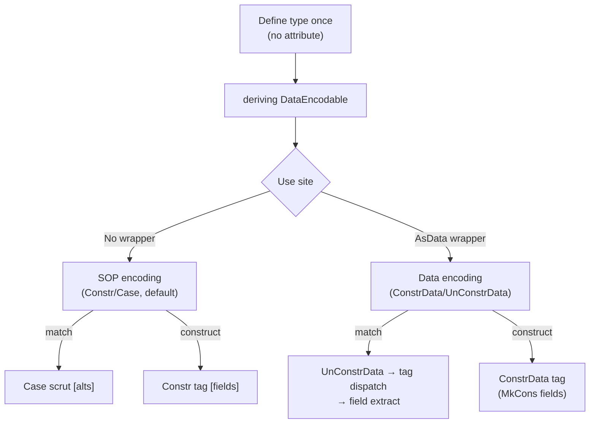

# Representational Polymorphism: Feasibility Analysis

## 1. Current System

Representation is a **global, permanent** decision via tag attributes:

```lean
@[plutus_sop]   -- or no attribute (SOP is default)
inductive Color where | red | green | blue

@[plutus_data]
inductive TxOutRef where | txOutRef : TxId → Int → TxOutRef
```

`getPlutusRepr env typeName` checks the tag once. This lookup drives two divergent paths:

| Aspect | SOP | Data |
|--------|-----|------|
| **Construct** | `Constr tag [f0, f1]` | `ConstrData tag (MkCons (IData f0) ...)` |
| **Destruct** | `Case scrut [alt0, alt1]` | `UnConstrData` → `FstPair`/`SndPair` → `EqualsInteger` chain → `HeadList`/`UnIData` |
| **Field types** | Anything | Must be Data-compatible (Int, ByteString, Data, List Data, other @[plutus_data]) |
| **UPLC ops** | Native Constr/Case | Builtin applications |

This forces the Cardano V3 types to define `MaybeData` separately from Lean's `Option`:

```lean
@[plutus_data]
inductive MaybeData (α : Type) where
  | justData : α → MaybeData α
  | nothingData : MaybeData α
```

---

## 2. The Goal

Define a type **once**:

```lean
inductive Maybe (α : Type) where
  | nothing : Maybe α
  | just : α → Maybe α
```

Choose representation at **use-site**:

```lean
AsSOP (Maybe Int)   -- Constr 0 [] or Constr 1 [n]
AsData (Maybe Int)  -- ConstrData 0 [] or ConstrData 1 [IData n]
```

With constraint enforcement: `AsData T` requires all of T's fields to be Data-representable.

---

## 3. Technical Challenges

### 3.1 The translator sees kernel expressions, not source annotations

By the time `compile!` calls `translateExpr`, Lean has fully elaborated the expression. When the translator hits `Maybe.casesOn`, it currently looks up `getPlutusRepr env ``Maybe` — a global property. There is no local "this particular Maybe is Data-encoded" information surviving from the source.

### 3.2 Encoding consistency

SOP and Data values are physically different on the UPLC machine:

```
SOP:   Constr 1 [42]
Data:  ConstrData 1 (MkCons (IData 42) [])
```

Constructing as SOP and destructing as Data (or vice versa) crashes at runtime. The type system must prevent this.

### 3.3 Recursive constraints

`AsData (Maybe (List (Pair Int ByteString)))` requires:
- `Maybe` is Data-encodable
- Its field `List (Pair Int ByteString)` is Data-encodable
- `Pair Int ByteString` is Data-encodable
- `Int` → IData, `ByteString` → BData

This must propagate transitively.

### 3.4 Typeclass instances are erased

The translator cannot inspect typeclass instances in kernel expressions. However, `compile!` runs in `MetaM` where typeclass resolution is available — this is the key leverage point.

---

## 4. Approaches

### Approach A: Explicit conversion boundaries (Plutarch-style)

**User code**:

```lean
-- Define once
inductive Maybe (α : Type) where
  | nothing | just : α → Maybe α

deriving instance DataEncodable for Maybe

@[onchain]
noncomputable def processMaybe (d : AsData (Maybe Int)) : Int :=
  -- Data → SOP conversion, then SOP pattern match
  match fromAsData d with
  | .just n => n
  | .nothing => 0

@[onchain]
noncomputable def constructData (n : Int) : AsData (Maybe Int) :=
  toAsData (.just n)
```

**What UPLC looks like**:

```
-- fromAsData emits: UnConstrData → reconstruct Constr
-- match emits: Case on that Constr
-- NET: UnConstrData → rebuild Constr 1 [UnIData ...] → Case → extract field
--      ^^^^^^^^^^^^^^^^^^^^^^^^^^^^^^^^^^^^^^^^^^^^^^^^
--      WASTEFUL: builds SOP value only to immediately destruct it
```

**Pros**:
- Minimal translator surgery
- No risk of repr mismatch
- Clean mental model

**Cons**:
- **Round-trip overhead**: `fromAsData` builds an SOP value, `match` immediately destructs it. The Data→SOP→fields path generates unnecessary Constr/Case ops that a direct Data→fields path avoids.
- Explicit conversion calls at every boundary
- Nested conversions verbose

**Feasibility**: **High** but **inefficient at runtime**.

### Approach B: Compiler-recognized wrapper with type tracking

**User code**:

```lean
inductive Maybe (α : Type) where
  | nothing | just : α → Maybe α

@[onchain]
noncomputable def processMaybe (d : AsData (Maybe Int)) : Int :=
  -- Compiler sees AsData wrapper → emits Data encoding path directly
  -- No intermediate SOP construction
  match d with
  | .just n => n
  | .nothing => 0

@[onchain]
noncomputable def processMaybeSOP (s : Maybe Int) : Int :=
  -- No wrapper → SOP path as usual
  match s with
  | .just n => n
  | .nothing => 0

@[onchain]
noncomputable def constructData (n : Int) : AsData (Maybe Int) :=
  -- Compiler sees AsData return → emits ConstrData directly
  .just n
```

**What UPLC looks like**:

```
-- processMaybe (Data path, directly):
-- UnConstrData d → FstPair/SndPair → EqualsInteger tag dispatch → HeadList/UnIData
-- NO intermediate Constr/Case. Goes straight from Data to fields.

-- processMaybeSOP (SOP path):
-- Case s [0, λn.n]

-- constructData (Data path):
-- ConstrData 1 (MkCons (IData n) [])
```

**How it works**: The translator tracks repr per-variable. When it encounters `Maybe.casesOn` on a scrutinee that came from an `AsData`-typed binding, it uses the Data encoding path. When it encounters a constructor in a context where the result must be `AsData`, it uses ConstrData.

**The hard part — same type, two reprs in one function**:

```lean
def f (x : AsData (Maybe Int)) (y : Maybe Int) : ... := ...
```

`x` needs Data encoding, `y` needs SOP. The repr is **per-variable**, not per-type. This requires tracking which variables carry which repr through the translation.

**Pros**:
- Transparent to the user (no explicit encode/decode)
- **Zero overhead** — emits the optimal encoding path directly
- Clean syntax

**Cons**:
- Requires per-variable repr tracking in the translator (significant new complexity)
- Higher-order cases are hard (what repr does `Maybe` have inside a `(Maybe Int → Maybe Int)` callback?)
- Pre-processing pass needed in `compile!`

**Feasibility**: **Medium**. Doable but substantial.

### Approach C: Repr as type-level parameter

**User code**:

```lean
inductive Repr where | sop | data

inductive Maybe (r : Repr) (α : Type) where
  | nothing : Maybe r α
  | just : α → Maybe r α

@[onchain]
noncomputable def processMaybe (d : Maybe .data Int) : Int :=
  -- Compiler reads .data param → Data path directly
  match d with
  | .just n => n
  | .nothing => 0

@[onchain]
noncomputable def processMaybeSOP (s : Maybe .sop Int) : Int :=
  -- Compiler reads .sop param → SOP path
  match s with
  | .just n => n
  | .nothing => 0

-- Every function signature is polluted with repr:
@[onchain]
noncomputable def mapMaybe (r : Repr) (f : Int → Int) (x : Maybe r Int) : Maybe r Int :=
  match x with
  | .just n => .just (f n)
  | .nothing => .nothing
```

**What UPLC looks like**: Same as Approach B — direct path, no round-trip. The compiler reads the `.data`/`.sop` literal and dispatches.

**Problem**: `Repr` is a value, not a type. It would NOT be erased by `isErasableBinder` (which erases Sort-typed things). It would produce a UPLC lambda parameter. We'd need to special-case `Repr` as erasable.

More fundamentally, every type signature is polluted with the `r` parameter.

**Feasibility**: **Low**. Poor ergonomics, invasive changes.

### Approach D: Macro-generated dual types

**User code**:

```lean
-- User writes once:
@[plutus_type]
inductive Maybe (α : Type) where
  | nothing | just : α → Maybe α

-- Macro generates Maybe.SOP (with @[plutus_sop]) and Maybe.Data (with @[plutus_data])
-- User picks the right one at use-site:

@[onchain]
noncomputable def processMaybe (d : Maybe.Data Int) : Int :=
  -- Uses existing @[plutus_data] path — direct, no round-trip
  match d with
  | .just n => n
  | .nothing => 0

@[onchain]
noncomputable def processMaybeSOP (s : Maybe.SOP Int) : Int :=
  -- Uses existing @[plutus_sop] path
  match s with
  | .just n => n
  | .nothing => 0
```

**What UPLC looks like**: Identical to current system — `Maybe.Data` uses the existing Data path, `Maybe.SOP` uses the existing SOP path. No translator changes at all.

**Pros**:
- **Zero translator changes** — both generated types use existing paths
- **Zero overhead** — each type uses its native encoding
- Type safety is automatic
- Can be done entirely in Lean metaprogramming

**Cons**:
- Duplicates every type definition behind the scenes
- User-facing names get awkward (`Maybe.SOP` vs `Maybe.Data`)
- Conversion functions between representations still needed if you need to cross

**Feasibility**: **High** (pure metaprogramming).

### Efficiency comparison

| Approach | `match` on Data-encoded value | Extra UPLC ops |
|----------|-------------------------------|----------------|
| **A** | UnConstrData → rebuild Constr → Case | **Yes, full round-trip** |
| **B** | UnConstrData → tag dispatch → field extract directly | **None** |
| **C** | Same as B (compiler reads `.data` param) | **None** |
| **D** | Same as current `@[plutus_data]` path | **None** |

Only Approach A has the round-trip problem. B, C, and D all go directly from the wire representation to field extraction.

---

## 5. Constraint Checking via Typeclasses

Regardless of approach, you need a way to verify Data-compatibility. Lean typeclasses handle this naturally:

```lean
class DataEncodable (α : Type) where
  toData : α → Data
  fromData : Data → α

-- Primitives
instance : DataEncodable Int where
  toData n := .I n
  fromData d := match d with | .I n => n | _ => 0

instance : DataEncodable ByteString where
  toData bs := .B bs
  fromData d := match d with | .B bs => bs | _ => ByteArray.empty

instance : DataEncodable Data where
  toData d := d
  fromData d := d

-- Recursive: if α is DataEncodable, Maybe α is too
instance [DataEncodable α] : DataEncodable (Maybe α) where
  toData x := match x with
    | .nothing => Data.Constr 0 []
    | .just a => Data.Constr 1 [DataEncodable.toData a]
  fromData d := match d with
    | .Constr 0 _ => .nothing
    | .Constr 1 (a :: _) => .just (DataEncodable.fromData a)
    | _ => .nothing

-- Lists
instance [DataEncodable α] : DataEncodable (List α) where
  toData xs := .List (xs.map DataEncodable.toData)
  fromData d := match d with | .List xs => xs.map DataEncodable.fromData | _ => []
```

Lean's instance resolution enforces constraints at elaboration time:

```lean
-- This works: Int is DataEncodable
def f (x : AsData (Maybe Int)) := ...

-- This fails at elaboration: (Int → Int) has no DataEncodable instance
def g (x : AsData (Maybe (Int → Int))) := ...  -- ERROR
```

### Bool

The open question from `Questions.md` #4 is resolved naturally:

```lean
instance : DataEncodable Bool where
  toData b := if b then Data.Constr 1 [] else Data.Constr 0 []
  fromData d := match d with | .Constr 1 _ => true | _ => false
```

If you don't want Bool in Data, just don't define the instance. Users get a clear error.

### Deriving

A `deriving DataEncodable` handler can auto-generate instances by:
1. Inspecting the inductive's constructors
2. For each non-erased field, checking that `DataEncodable fieldType` resolves
3. Generating the ConstrData/UnConstrData pattern

---

## 6. Recommended Approach: B (Compiler-Recognized Wrapper)

Given that the round-trip in Approach A is unacceptable — you always want to deconstruct SOP/Data directly without intermediary conversion — Approach B is the right target. It gives the user clean syntax while the compiler emits the optimal encoding path.

Approach D is a viable alternative if the translator complexity of B is too high. It achieves the same efficiency via metaprogramming at the cost of duplicated type names.

### Detailed Design for Approach B

#### Surface syntax

```lean
-- Define once, no attribute
inductive Maybe (α : Type) where
  | nothing : Maybe α
  | just : α → Maybe α

-- Constraint class (needed for AsData)
deriving instance DataEncodable for Maybe

-- Usage: AsData wrapper controls encoding, transparent to the user
@[onchain]
noncomputable def processMaybe (d : AsData (Maybe Int)) : Int :=
  match d with          -- compiler emits Data path directly
  | .just n => n        -- no round-trip
  | .nothing => 0

@[onchain]
noncomputable def constructData (n : Int) : AsData (Maybe Int) :=
  .just n               -- compiler emits ConstrData 1 [IData n]

@[onchain]
noncomputable def processSOP (s : Maybe Int) : Int :=
  match s with          -- no wrapper → SOP path as usual
  | .just n => n
  | .nothing => 0
```

#### What the translator emits

For `processMaybe` (Data path, direct):

```
-- UnConstrData d → tag dispatch → field extraction. No intermediate SOP.
let pair = UnConstrData d
let tag = FstPair pair
let fields = SndPair pair
Case (EqualsInteger tag 0)
  [ -- tag ≠ 0 (just): UnIData (HeadList fields)
    λn. n
  , -- tag = 0 (nothing): 0
    0
  ]
```

For `constructData` (Data construction, direct):

```
-- ConstrData directly. No intermediate Constr.
ConstrData 1 (MkCons (IData n) [])
```

For `processSOP` (SOP path, unchanged):

```
Case s [0, λn. n]
```

#### Pre-processing in `compile!`

Before calling `translateDef`, scan the definition to build a **per-variable repr map**:

```lean
/-- Walk a definition's type and body to determine which variables
    carry AsData/AsSOP wrappers. Returns a map from binder index
    to the repr and inner type name. -/
def extractVarReprs (defExpr : Lean.Expr) : MetaM (HashMap Nat ReprInfo) := do
  let mut reprs : HashMap Nat ReprInfo := {}
  let mut binderIdx := 0
  let mut ty := defExpr
  while ty.isForall || ty.isLam do
    match ty with
    | .forallE _ dom body _ | .lam _ dom body _ =>
      if let some (repr, innerTypeName) := matchReprWrapper dom then
        reprs := reprs.insert binderIdx { repr, innerTypeName }
      ty := body
      binderIdx := binderIdx + 1
    | _ => break
  pure reprs
```

Where `matchReprWrapper` recognizes `AsData (Maybe Int)` → `(.data, ``Maybe)`.

#### TranslateCtx extension

```lean
structure TranslateCtx where
  locals : List MIR.VarId
  ...
  /-- Per-variable repr: when a variable was bound with AsData/AsSOP wrapper,
      record which type to override and which encoding to use. -/
  varReprMap : HashMap MIR.VarId (Name × PlutusRepr) := {}
```

#### Modified casesOn dispatch

```lean
partial def translateCasesOn (caseName : Name) (args : Array Lean.Expr)
    : TranslateM MIR.Expr := do
  let typeName := caseName.getPrefix
  let env ← getEnv
  match env.find? typeName with
  | some (.inductInfo iv) =>
    let np := iv.numParams
    let scrutIdx := np + 1
    let scrut ← translateExpr args[scrutIdx]!
    -- NEW: determine repr from scrutinee's variable, falling back to global attribute
    let repr ← resolveReprForScrutinee scrut typeName
    if repr == .sop then
      -- existing SOP path
      ...
    else
      -- existing Data path
      translateDataCasesOn env iv np scrut args (scrutIdx + 1) iv.ctors.length
  | _ => ...
```

Where `resolveReprForScrutinee` checks if the scrutinee traces back to a variable with an `AsData` annotation:

```lean
private def resolveReprForScrutinee (scrut : MIR.Expr) (typeName : Name)
    : TranslateM PlutusRepr := do
  let ctx ← read
  let env ← getEnv
  -- Check if scrutinee is a variable with a repr override
  if let .Var v := scrut then
    if let some (overrideName, repr) := ctx.varReprMap.find? v then
      if overrideName == typeName then return repr
  -- Fall back to global attribute
  pure (getPlutusRepr env typeName)
```

#### Wrapper erasure

In `translateExpr`, recognize `AsData.mk`/`AsData.val` as identity and propagate repr info:

```lean
-- When translating a lambda whose binder type is AsData α:
| .lam name ty body bi => do
  if let some (repr, innerTypeName) := matchReprWrapper ty then
    -- Erase the wrapper, bind with repr annotation
    let v ← freshVarId name.toString
    let body' ← withReader (fun ctx => { ctx with
      locals := v :: ctx.locals
      varReprMap := ctx.varReprMap.insert v (innerTypeName, repr)
    }) (translateExpr body)
    pure (.Lam v body')
  else
    -- normal path
    ...

-- AsData.mk x → translate x (wrapper is erased)
-- AsData.val d → translate d (wrapper is erased)
```

#### Constructor encoding override

Similarly, when building a constructor for a type that should be `AsData`:

```lean
-- In translateAppDirect, when encountering a constructor:
if let some (.ctorInfo cval) := env.find? name then
  -- NEW: check if the result type context requires Data encoding
  let repr ← resolveReprForConstruction cval.induct
  if repr == .sop then
    return .Constr cval.cidx valueArgs.toList
  else
    -- existing Data constructor path (ConstrData + field wrapping)
    ...
```

The question is how `resolveReprForConstruction` knows the context expects `AsData`. Two options:
1. **Return-type tracking**: propagate expected return type downward (bidirectional)
2. **Let-binding analysis**: when the result is bound to a variable typed `AsData (...)`, retroactively apply repr

Option 1 is cleaner but requires threading expected-type through the translator.

#### The hard case: same type, two reprs

```lean
def f (x : AsData (Maybe Int)) (y : Maybe Int) : Int :=
  let a := match x with | .just n => n | .nothing => 0  -- Data path
  let b := match y with | .just n => n | .nothing => 0  -- SOP path
  addInteger a b
```

This works because repr is tracked **per-variable**: `x` has `(``Maybe, .data)` in `varReprMap`, `y` does not. When `Maybe.casesOn` is called on `x`, it finds the override. When called on `y`, it falls through to the default (SOP).

#### What changes in existing code

1. **`Translate.lean`**: Add `varReprMap` to `TranslateCtx`, modify `translateCasesOn` and `translateAppDirect` to consult it, add wrapper erasure for `AsData.mk`/`AsData.val`
2. **`Compile.lean`**: Add pre-processing to populate `varReprMap` from binder types before calling `translateDef`
3. **`Attribute.lean`**: Define `AsData`/`AsSOP` structures
4. **New file `DataEncodable.lean`**: Typeclass + instances + deriving handler
5. **Existing `@[plutus_data]`/`@[plutus_sop]` code**: Unchanged, still works

#### Migration path

Current `@[plutus_data]` types remain valid. `AsData` is purely additive. Over time, `@[plutus_data]` can be seen as "this type is always Data-encoded" while `AsData` means "this particular value is Data-encoded".

---

## 7. Approach B: Open Problems

The detailed design above covers the common cases. These are the harder scenarios that need resolution:

### 7.1 Higher-order repr flow

```lean
@[onchain]
noncomputable def mapMaybe (f : Int → Int) (x : AsData (Maybe Int)) : AsData (Maybe Int) :=
  match x with
  | .just n => .just (f n)    -- return type is AsData → must emit ConstrData
  | .nothing => .nothing       -- must emit ConstrData 0 []
```

The constructor `.just (f n)` must know it's in a Data context. This requires propagating the expected return type inward. Two strategies:

**Strategy 1: Bidirectional typing** — thread an "expected repr" through the translator. When translating a constructor, check if an expected repr has been set by the enclosing context (function return type, let-binding type).

**Strategy 2: Post-hoc wrapper insertion** — translate everything as SOP by default, then at `AsData` boundaries, insert SOP→Data conversion. This is effectively Approach A's round-trip, localized to return positions. With a case-of-known-constructor optimization pass, the intermediate SOP would be eliminated:

```
-- Before optimization:
let sop = Constr 1 [f n]              -- SOP construction
Case sop [ConstrData 0 [], λn. ConstrData 1 [IData n]]  -- SOP→Data conversion

-- After case-of-known-constructor:
ConstrData 1 [IData (f n)]            -- direct Data construction
```

Strategy 2 is simpler to implement and relies on an optimization pass (case-of-known-constructor) that is already on the roadmap (Questions.md #9).

### 7.2 Nested AsData in fields

```lean
@[onchain]
noncomputable def processAddress (addr : AsData Address) : ... :=
  match addr with
  | .address cred stakingCred =>
    -- What repr is `cred : Credential`?
    -- What repr is `stakingCred : MaybeData StakingCredential`?
    ...
```

When destructing an `AsData Address`, the extracted fields are themselves Data-encoded (they came from a Data list). The translator needs to propagate the Data repr to field variables automatically.

This is natural: `buildFieldExtraction` already wraps fields with `UnIData`/`UnBData`. For fields that are themselves inductives, instead of leaving them as identity (current behavior for `@[plutus_data]` fields), the translator would mark them as Data-repr variables in `varReprMap`.

### 7.3 Polymorphic repr in function arguments

```lean
-- Can you write a function that works on both reprs?
def length (xs : ???List (Maybe Int)???) : Int := ...
```

This is the true representational polymorphism question. For now, the answer is **no** — a function either takes `AsData (Maybe Int)` or `Maybe Int`, not both. Full repr polymorphism (like GHC's levity polymorphism) would require a much deeper type system integration and is not worth pursuing at this stage.

---

## 8. DataEncodable Instance Resolution in the Translator

The translator needs to know **how** to encode/decode, not just **whether** it can. Two options:

### Option 1: Hard-coded type dispatch (extend current approach)

Extend `toDataWrapper`/`fromDataWrapper` to handle more types recursively. This is what Approach A requires.

**Pros**: Simple, no metaprogramming
**Cons**: Every new type needs translator code

### Option 2: Read the DataEncodable instance body

Since `compile!` runs in `MetaM`, it can resolve the `DataEncodable` instance and extract `toData`/`fromData` as `Lean.Expr`, then translate those expressions to MIR. The instance bodies ARE the encoding logic.

```lean
-- In compile! or translateExpr:
let instExpr ← synthInstance (mkApp (.const ``DataEncodable []) targetType)
let toDataFn ← mkAppM ``DataEncodable.toData #[instExpr]
-- Now translate toDataFn as regular Lean.Expr → MIR
```

**Pros**: Fully extensible — user-defined instances just work
**Cons**: Relies on instance body being efficiently translatable (match, constructor applications — all things the translator already handles)

**This is the elegant path**: the `DataEncodable` instance IS the encoder. The translator just translates it like any other function. No special cases needed.

**But**: The instance bodies use Lean `Data` constructors (`.Constr`, `.I`, etc.), not UPLC builtins. We'd need either:
- (a) The instance bodies to use Prelude builtins (`constrData`, `iData`, etc.) so the translator emits correct UPLC, or
- (b) A mapping from Lean `Data` constructors to UPLC builtins

Option (a) is cleaner:

```lean
instance [DataEncodable α] : DataEncodable (Maybe α) where
  toData x := match x with
    | .nothing => constrData 0 (mkNilData ())
    | .just a => constrData 1 (mkCons (DataEncodable.toData a) (mkNilData ()))
  fromData d :=
    let pair := unConstrData d
    let tag := fstPair pair
    let fields := sndPair pair
    if equalsInteger tag 0 then .nothing
    else .just (DataEncodable.fromData (headList fields))
```

These use the Prelude builtins that the translator already knows how to compile. The instance body **is already valid onchain code**.

---

## 9. Summary



| | Approach A | Approach B (Recommended) | Approach D |
|---|---|---|---|
| **Surface** | Explicit `toAsData`/`fromAsData` | Transparent `AsData` wrapper | `Maybe.SOP`/`Maybe.Data` names |
| **Efficiency** | **Round-trip overhead** | **Direct, zero overhead** | **Direct, zero overhead** |
| **Translator changes** | Small (add encode/decode) | Medium (per-variable repr tracking) | None (pure metaprogramming) |
| **Constraint checking** | `DataEncodable` typeclass | Same | Same |
| **Ergonomics** | Verbose (explicit calls) | Clean (transparent) | Awkward names |
| **Implementation effort** | ~200 lines | ~400 lines, touches TranslateCtx | ~300 lines, Lean macros |
| **Backwards compatible** | Fully | Fully | Fully |

### Recommendation

**Approach B** for the best efficiency + ergonomics tradeoff. The per-variable repr tracking is the main new complexity, but the core idea is simple: when the translator sees `Maybe.casesOn` on a variable that was bound as `AsData (Maybe Int)`, use the Data encoding path instead of SOP.

**Approach D** is a viable fallback if B's implementation complexity proves too high. It achieves the same efficiency via type duplication.

### Next steps if you want to proceed

1. Define `DataEncodable` typeclass with primitive instances
2. Define `AsData` structure with `[DataEncodable α]` constraint
3. Add `varReprMap : HashMap MIR.VarId (Name × PlutusRepr)` to `TranslateCtx`
4. Add wrapper detection: recognize `AsData`-typed lambda binders, populate `varReprMap`, erase wrapper
5. Modify `translateCasesOn` to consult `varReprMap` for scrutinee before global attribute
6. Modify `translateAppDirect` (constructor path) to consult context repr for return type
7. Propagate repr to extracted fields in `buildFieldExtraction`
8. Write a `deriving DataEncodable` handler for inductives
9. Test: `AsData (Maybe Int)` match, construct, mixed SOP/Data in same function
